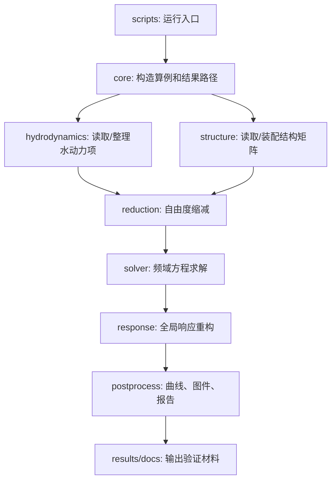

# 当前代码结构与清理记录

日期：2026-04-30

本文档说明当前本地 RODM 工作区的推荐阅读结构、主线代码职责，以及本轮清理中哪些文件已删除、哪些文件暂时保留。

更完整的用户说明见：

```text
docs/full_code_user_manual_cn.md
```

## 1. 当前推荐结构

```text
RODM_20250310_local/
├── README.md                         # 项目入口说明
├── src/offshore_energy_sim/           # 标准化 Python 包
├── scripts/                           # 可重复运行的命令行入口
├── configs/                           # YAML 算例配置
├── docs/                              # 中文说明和验证报告
├── references/                        # 论文图件、数字化曲线、历史程序
├── results/                           # 本机运行输出
├── .vscode/                           # VS Code 本地开发配置
└── DM_*.py / SEREP.py / RODM_*.ipynb  # 历史研究脚本和 notebook
```

新开发应优先进入 `src/offshore_energy_sim/`；新运行入口应优先进入 `scripts/`；根目录旧脚本只作为数值溯源和论文复现参考。

## 2. 标准包职责

| 包 | 职责 | 当前状态 |
| --- | --- | --- |
| `core` | 算例对象、配置读取、依赖检查、结果路径与指标写出。 | 主线使用中。 |
| `geometry` | 浮体几何和网格元数据。 | 轻量稳定。 |
| `environment` | 规则波、JONSWAP、API 风谱等环境模型。 | 已有验证。 |
| `hydrodynamics` | Capytaine/NetCDF 水动力数据读取、自由度整理、300 m 节点反序候选处理。 | 主线使用中。 |
| `structure` | Abaqus 矩阵读取、结构装配、铰接连接、10x10 模块网格。 | 铰接和 10x10 后续优化的核心。 |
| `reduction` | DOF 删除、主从自由度、SEREP、质量矩阵变换。 | 已有轻量回归。 |
| `solver` | 频域动力刚度矩阵和 RODM 频域求解入口。 | 主线使用中。 |
| `response` | 缩减响应重构、响应谱和 RMS 工具。 | 已有验证。 |
| `loads` | 风载、载荷向量扩展和网格载荷工具。 | 为风浪耦合预留。 |
| `strength` | 模块内力、界面力和强度后处理工具。 | 初步迁移。 |
| `power` | 光伏功率与倾角损失工具。 | 初步迁移。 |
| `postprocess` | 曲线读取、RMSE、绘图、参考算例报告。 | 主线使用中。 |
| `validation` | 连续体、Yoon 单/双铰、10x10 模块铰接验证流程。 | 主线使用中。 |
| `optimization` | 连接件位置/刚度优化的数据结构和后续入口。 | 预留中。 |
| `utils` | 哈希等通用工具。 | 轻量稳定。 |

## 3. 当前主流程



## 4. 当前推荐脚本

| 脚本 | 推荐用途 |
| --- | --- |
| `scripts/check_environment.py` | 检查环境是否能跑核心流程。 |
| `scripts/run_regular_wave_batch_validation.py` | 连续性浮体 60-300 m 波长验证。 |
| `scripts/run_yoon_hinge_cases.py` | 单铰接和双铰接标准验证。 |
| `scripts/run_complex_hinge_10x10.py` | 10x10 模块铰接检查和求解入口。 |
| `scripts/build_hydroelastic_validation_report.py` | 生成连续体 + 铰接总报告。 |
| `scripts/run_rodm_case_from_config.py` | 配置驱动单算例运行入口。 |

其他 `validate_*.py` 脚本主要用于开发时回归检查；300 m 相关诊断脚本保留为历史问题溯源。

## 5. 本轮已删除内容

| 文件 | 删除原因 | 数值影响 |
| --- | --- | --- |
| `src/offshore_energy_sim/core/paths.py` | 仅包含未被当前包、脚本或文档引用的 `repo_root_from_file` 小工具。 | 无数值影响。 |

同时新增 `.gitignore`，避免 `__pycache__`、`.pytest_cache`、`.ipynb_checkpoints`、`.DS_Store` 等临时文件继续污染代码树。

## 6. 暂不删除的内容

| 文件类型 | 暂不删除原因 |
| --- | --- |
| `DM_*.py`、`SEREP.py` | 原始数值核和历史对照基准，仍用于证明重构未改变结果。 |
| `RODM_*.ipynb`、`FEM_Reduce_*.ipynb` | 论文复现和研究过程记录，部分铰接/10x10 逻辑仍需溯源。 |
| `*.npy` | 历史响应基准或当前验证输出。 |
| `*.inp` | Abaqus 边界条件或模型输入，属于结构模型溯源资料。 |
| `DM_Hinge.zip` | 可能是旧铰接程序备份，删除前需要确认是否已完整归档。 |
| `results/` | 当前报告和图片依赖其中的图件、响应数组和 JSON 索引。 |
| `references/` | 论文图件、数字化曲线和历史程序，是验证依据。 |

## 7. 后续可批准的清理候选

如果后续希望进一步“瘦身”，建议按以下顺序处理：

1. 将根目录旧 notebook 复制或移动到 `archive/notebooks/`，但保留 `RODM_Hige_study_plan_a_2.ipynb`、`RODM_2D_complex.ipynb`、`RODM_Advantage_work4.ipynb` 的明确索引。
2. 将根目录旧 Python 脚本复制或移动到 `archive/legacy_scripts/`，只在根目录保留 `README.md` 和标准包入口。
3. 将根目录 `.npy/.inp/.zip` 转移到 `archive/legacy_artifacts/` 或 `references/legacy_artifacts/`，并在文档中记录来源。
4. 将 `scripts/run_yoon_hinge_response_validation.py` 等早期入口标记为 deprecated，确认图件和数据已由 `run_yoon_hinge_cases.py` 完全覆盖后再删除。
5. 将 `docs/code_map.md` 这类早期英文审计文档合并到中文结构文档后，再决定是否保留。

这些操作会改变历史文件位置，建议单独批准后执行。
