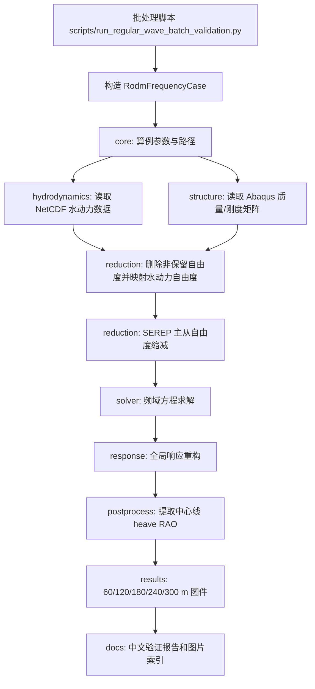
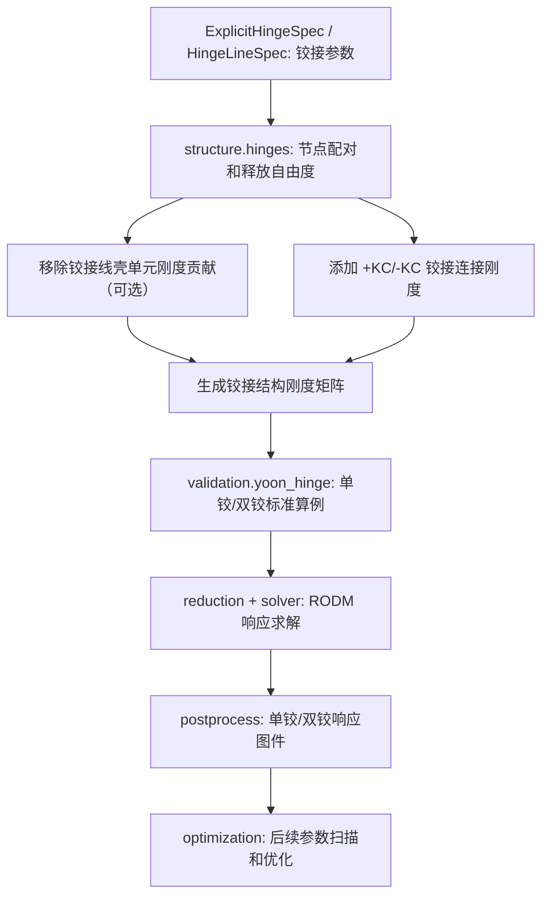
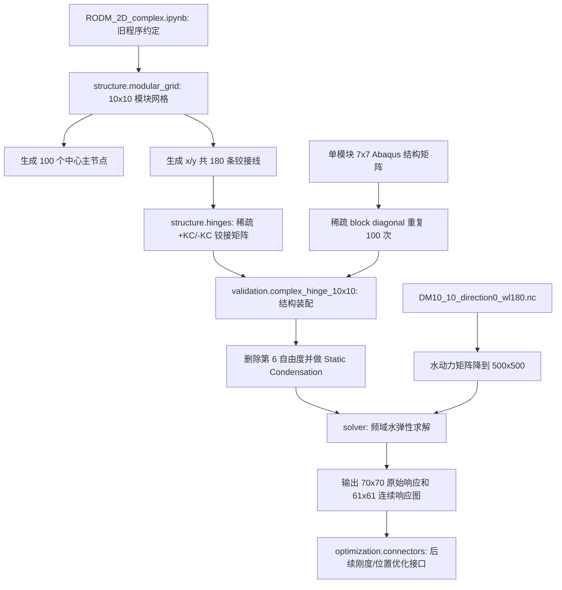

# RODM 代码结构说明

日期：2026-04-29

本文档面向后续“一体化分析软件”建设，说明当前本机工作副本中的代码组织、各包职责和主要计算流程。

本机工作副本位于：

```text
/Users/yongkang/Projects/RODM_20250310_local
```

OneDrive 原目录仅作为参考源，不建议在后续开发中直接运行或频繁写入。

## 1. 总体结构

当前代码处于“历史研究脚本 + 标准化程序包 + 验证脚本”并存阶段。

建议新使用者优先阅读：

| 文档 | 适合谁 | 内容 |
| --- | --- | --- |
| `docs/user_guide_cn.md` | 第一次使用代码的人 | 快速上手、运行命令、数据目录、每个包和核心函数的用途。 |
| `docs/code_line_notes_cn.md` | 需要读源码或继续开发的人 | 按主流程和函数位置解释关键代码，相当于源码旁路中文注释。 |
| `docs/hydroelastic_validation_report.md` | 需要查看最终验证结论的人 | 连续性浮体 60-300 m 与单铰/双铰浮体对比验证总报告。 |
| `docs/yoon_hinge_standard_interface.md` | 做单铰/双铰验证的人 | Yoon 铰接验证算例、数值约定和运行方式。 |
| `docs/complex_hinge_10x10_interface.md` | 做 10x10 模块铰接的人 | 10x10 模块网格、铰接线、计算流程和优化预留接口。 |

| 路径 | 作用 |
| --- | --- |
| `DM_*.py`、`SEREP.py`、`RODM_*.ipynb` | 早期研究、论文复现和数值溯源脚本。短期内仍应保留，作为包化重构的对照基准。 |
| `src/offshore_energy_sim/` | 面向一体化软件的标准 Python 包。核心算法会逐步从旧脚本迁移到这里。 |
| `scripts/` | 可重复运行的验证、批处理和报告生成入口。建议后续所有验收都通过这里执行。 |
| `configs/` | 配置驱动算例。后续应把结构模型、铰接参数、波况参数都纳入 YAML。 |
| `results/` | 本机计算结果、响应数组、图件和指标文件。 |
| `docs/` | 代码结构、验证结论、环境部署和流程说明文档。 |

## 2. 标准包职责

| 包 | 主要职责 | 典型文件 |
| --- | --- | --- |
| `core` | 定义算例对象、配置读取、路径管理和工作流文件组织，是平台化入口层。 | `cases.py`、`config.py`、`workflow.py` |
| `geometry` | 描述浮体几何和网格相关的轻量对象，为结构、水动力和后处理提供几何上下文。 | `floating_body.py` |
| `environment` | 生成或处理波浪谱、规则波和环境条件。后续可扩展到风、流和联合环境。 | `spectra.py`、`waves.py` |
| `hydrodynamics` | 读取和整理水动力 NetCDF 数据，包括附加质量、辐射阻尼、静水恢复力和波浪力。 | `netcdf.py`、`frequency.py` |
| `structure` | 读取 Abaqus 矩阵，装配结构矩阵，处理连接、铰接、模块网格和结构自由度。铰接优化会重点依赖此包。 | `matrix_io.py`、`assembly.py`、`connectors.py`、`hinges.py`、`modular_grid.py` |
| `reduction` | 执行自由度删除、主从自由度划分、SEREP 模态缩减和质量矩阵变换。 | `dofs.py`、`modal.py` |
| `solver` | 组织频域动力方程并求解 RODM 响应，是水弹性计算的数值核心入口。 | `frequency_domain.py`、`rodm_frequency.py` |
| `response` | 将缩减坐标响应重构回全局响应，并管理保留自由度布局。 | `reconstruction.py`、`retained_dofs.py` |
| `loads` | 处理载荷映射和风载荷工具，为后续风浪耦合与多能源载荷分析预留接口。 | `vector_mapping.py`、`wind.py` |
| `strength` | 计算或整理内力、强度相关后处理量。 | `internal_forces.py` |
| `power` | 光伏或能源输出相关计算，服务一体化“结构-能源”分析。 | `pv.py` |
| `postprocess` | 提取中心线响应、计算验证指标、绘图和生成工作流报告。 | `reference_case_300.py`、`plots.py`、`workflow_report.py` |
| `validation` | 论文/试验对比验证流程。目前包含 Yoon 单铰/双铰接口，以及从 `RODM_2D_complex.ipynb` 抽出的 10x10 模块铰接接口。 | `yoon_hinge.py`、`complex_hinge_10x10.py` |
| `optimization` | 后续铰接模型优化、参数扫描和目标函数入口。当前已预留连接件设计变量与目标函数描述对象。 | `connectors.py` |
| `utils` | 哈希、通用工具等跨包小功能。 | `hashing.py` |

## 3. 连续性浮体水弹性计算流程



该流程的关键输入包括：

- 水动力文件：`DM10_60_direction0.nc`、`DM10_120_direction0.nc`、`DM10_180_direction0.nc`、`DM10_240_direction0.nc`、`DM10_300_direction0.nc`
- 结构矩阵：`JobMesh5_5_MASS1.mtx`、`JobMesh5_5_STIF1.mtx`
- 对比曲线：`exp_*.txt`、`fu_sim*.txt`

如果这些外部输入暂时没有迁移到 Mac，本机仍可复用已有 `results/regular_wave_batch/wavelength_*m/response.npy` 和历史对比图件。

## 4. 铰接模型相关流程



铰接程序目前已经完成两类基础验证：

- `DM_Hinge.py` 与 `offshore_energy_sim.structure.hinges` 的装配核函数等价性检查，最大误差为 0。
- 63 节点铰接 Abaqus 模态验证已有历史报告，但在 Mac 上完整重跑需要恢复外部 `DM-FEM2D` 数据。
- `RODM_Hige_study_plan_a_2.ipynb` 中的单铰、双铰和斜入射双铰已经抽象为 `offshore_energy_sim.validation.yoon_hinge`，统一入口为 `scripts/run_yoon_hinge_cases.py`。

Yoon 铰接验证的标准运行命令：

```bash
/Users/yongkang/miniconda3/envs/offshore-energy-sim/bin/python scripts/run_yoon_hinge_cases.py --case all
```

如果数据集不在默认的 `/Users/yongkang/data/DM-FEM2D`，可以使用：

```bash
/Users/yongkang/miniconda3/envs/offshore-energy-sim/bin/python scripts/run_yoon_hinge_cases.py --case all --data-root /path/to/DM-FEM2D
```

## 5. 10x10 模块铰接水弹性流程



10x10 标准入口：

```bash
/Users/yongkang/miniconda3/envs/offshore-energy-sim/bin/python scripts/run_complex_hinge_10x10.py --skip-solve
```

当前本机已有 10x10 水动力数据，但尚未找到旧 notebook 指向的 `Hinge_complex_paper4/Job3030hinge-1_MASS1.mtx` 与 `Job3030hinge-1_STIF1.mtx`。结构矩阵传输完成后，去掉 `--skip-solve` 即可运行完整水弹性计算。

## 6. 后续平台化建议

短期建议先稳定验证链路，再推进界面和优化：

1. 把 Windows 的 `DM-FEM2D` 外部数据复制到本机，并设置 `RODM_DM_FEM_ROOT`。
2. 使用 `scripts/run_regular_wave_batch_validation.py` 生成 60-300 m 图件型验证报告。
3. 将 `HingeLineSpec` 纳入 YAML 配置，建立单铰、双铰和多铰配置模板。
4. 在 `optimization` 中继续扩展参数扫描入口，例如铰接刚度、释放自由度、铰接位置和连接件启用/关闭变量。
5. 在一体化软件中优先调用 `src/offshore_energy_sim` 包接口，避免直接依赖旧 notebook。
