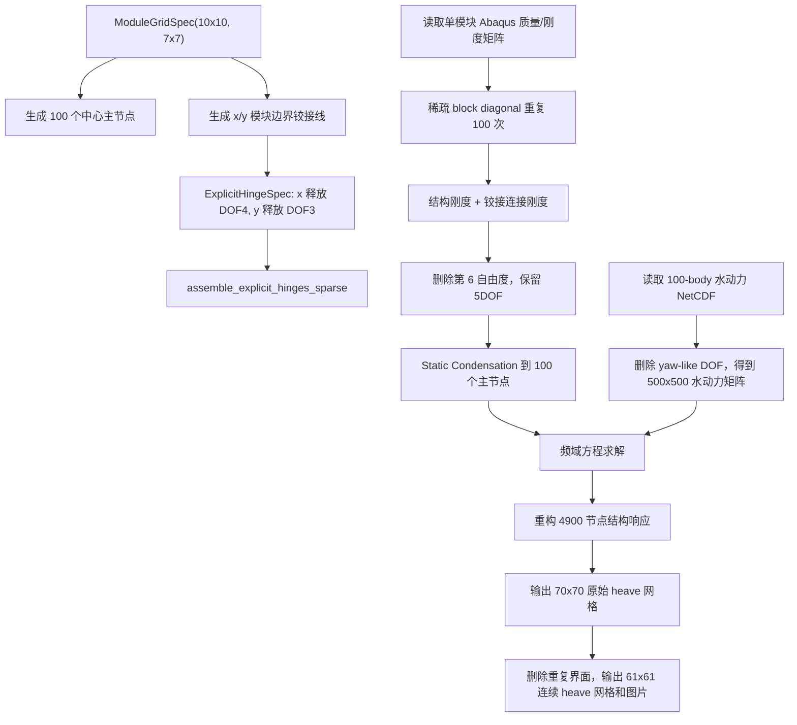

# 10x10 模块铰接水弹性标准接口说明

日期：2026-04-29

本文档说明从 `RODM_2D_complex.ipynb` 和 `RODM_complex_interconnection.py` 抽出的 10x10 模块铰接算例。目标是先形成可重复运行的标准入口，再为后续连接件位置和刚度优化保留接口。

## 1. 标准化范围

| 项目 | 当前约定 |
| --- | --- |
| 总体结构 | 10x10 模块阵列，共 100 个 30 m x 30 m 模块 |
| 结构网格 | 每个模块 7x7 节点，共 49 节点 |
| 总结构节点 | 4900 个节点，原始 6DOF，计算时删除第 6 自由度后保留 5DOF |
| 主节点 | 每个模块中心节点，共 100 个主节点，对应水动力 100 个 body |
| x 向铰接 | 90 条线，每条 7 对节点，释放 local DOF 4，小惩罚刚度 10 |
| y 向铰接 | 90 条线，每条 7 对节点，释放 local DOF 3，小惩罚刚度 10 |
| 水动力数据 | `DM10_10_direction0_wl180.nc` |
| 降阶方法 | Static Condensation |
| 静水恢复力 | `hydrostatic_stiffness / 1.05` |

## 2. 新增程序入口

| 文件 | 职责 |
| --- | --- |
| `src/offshore_energy_sim/structure/modular_grid.py` | 定义模块网格、中心主节点、x/y 模块边界铰接节点对生成规则。 |
| `src/offshore_energy_sim/validation/complex_hinge_10x10.py` | 定义 10x10 标准算例、输入检查、稀疏结构装配、静态凝聚、水弹性求解和后处理。 |
| `scripts/run_complex_hinge_10x10.py` | 一键检查或运行 10x10 算例，输出报告、响应数组和图件。 |
| `scripts/validate_complex_hinge_10x10_setup.py` | 轻量检查 10x10 节点编号、铰接线数量、主节点数量是否与旧程序一致。 |
| `src/offshore_energy_sim/optimization/connectors.py` | 预留连接件刚度、释放刚度、目标函数等优化问题描述对象。 |

## 3. 计算流程



## 4. 当前数据状态

当前本机已经有水动力文件：

```text
/Users/yongkang/data/DM-FEM2D/HydrodynamicData/Yoon_hinge/DM10_10_direction0_wl180.nc
```

旧 notebook 指向的结构矩阵还没有在本机数据目录中找到：

```text
/Users/yongkang/data/DM-FEM2D/StructureData/Hinge_complex_paper4/Job3030hinge-1_MASS1.mtx
/Users/yongkang/data/DM-FEM2D/StructureData/Hinge_complex_paper4/Job3030hinge-1_STIF1.mtx
```

因此当前标准脚本会先输出清晰的缺失清单。结构矩阵传输完成后，不需要再改程序，直接重新运行即可。

## 5. 运行方式

只检查算例结构和输入数据：

```bash
/Users/yongkang/miniconda3/envs/offshore-energy-sim/bin/python scripts/run_complex_hinge_10x10.py --skip-solve
```

输入完整后运行水弹性计算：

```bash
/Users/yongkang/miniconda3/envs/offshore-energy-sim/bin/python scripts/run_complex_hinge_10x10.py
```

轻量检查节点和铰接生成规则：

```bash
/Users/yongkang/miniconda3/envs/offshore-energy-sim/bin/python scripts/validate_complex_hinge_10x10_setup.py
```

## 6. 优化接口预留

后续连接件优化建议优先从三个层次展开：

1. 刚度优化：先把 x 向和 y 向铰接刚度作为两个统一变量，例如 `k_hinge_x`、`k_hinge_y`。
2. 分区优化：再把边界、角部、中心区域的连接件分组，形成区域刚度变量。
3. 位置优化：最后再引入连接件是否启用、连接线位置移动等离散变量。

目前 `optimization.connectors` 已经预留 `ConnectorDesignVariable`、`ConnectorObjectiveSpec` 和 `ConnectorOptimizationProblem`，后续可以把目标函数接到 10x10 求解结果，例如最大 heave、平均 heave、连接件力或局部变形指标。
