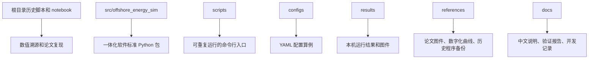
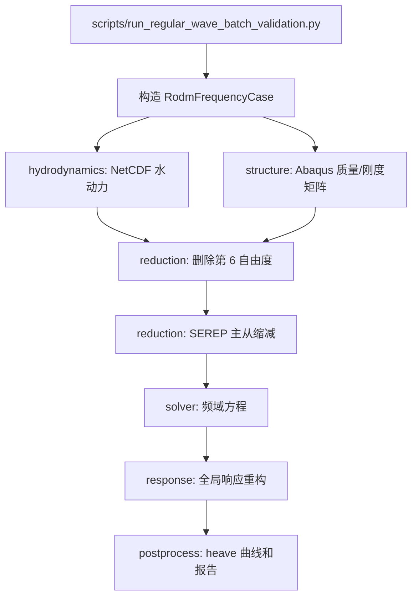
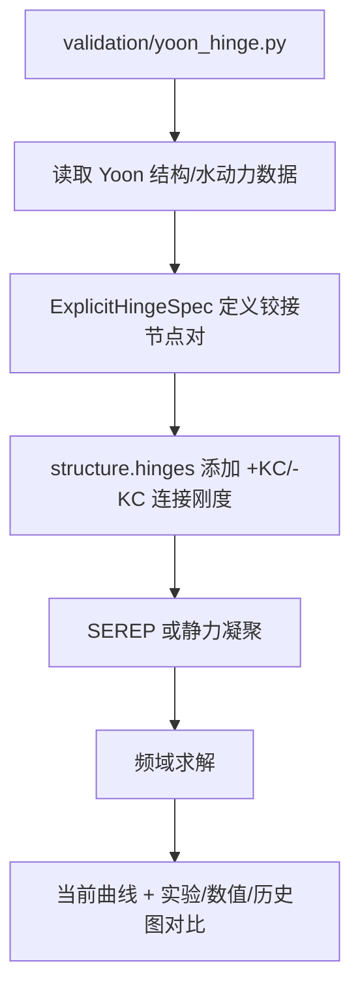
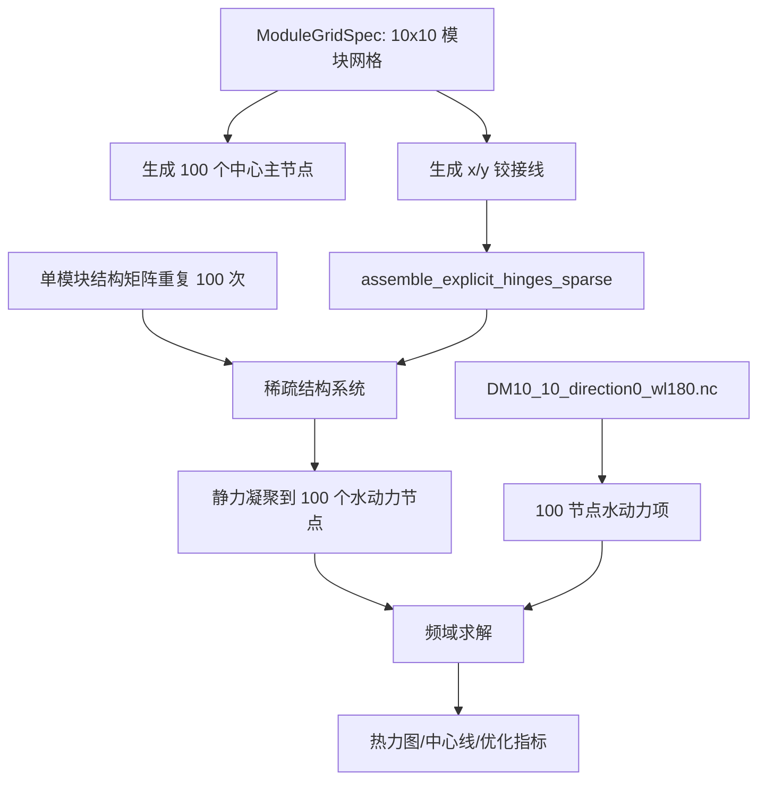

# RODM 本地代码完整用户说明

日期：2026-04-30

本文档面向后续使用者和开发者，解释本地 RODM 工作区的整体结构、每个文件夹的作用，以及每一个 `.py` 文件的职责。它的目标不是替代源码，而是帮助新使用者快速判断：

- 从哪里开始运行程序；
- 哪些文件是当前标准框架；
- 哪些文件是历史论文复现/溯源文件；
- 连续性浮体、单铰接、双铰接、10x10 模块铰接分别在哪里；
- 后续做连接件位置和刚度优化时，应优先扩展哪些包。

当前本机工作区：

```text
/Users/yongkang/Projects/RODM_20250310_local
```

推荐先看根目录 `README.md`，再看本文档。

## 1. 使用者最短路径

如果只是运行验证结果，优先使用 `scripts/` 中的标准入口，不要直接运行旧 notebook。

| 任务 | 推荐命令 |
| --- | --- |
| 检查环境 | `/Users/yongkang/miniconda3/envs/offshore-energy-sim/bin/python scripts/check_environment.py` |
| 连续性浮体 60-300 m 验证 | `/Users/yongkang/miniconda3/envs/offshore-energy-sim/bin/python scripts/run_regular_wave_batch_validation.py` |
| 单铰接/双铰接验证 | `/Users/yongkang/miniconda3/envs/offshore-energy-sim/bin/python scripts/run_yoon_hinge_cases.py --case all` |
| 10x10 模块铰接输入检查 | `/Users/yongkang/miniconda3/envs/offshore-energy-sim/bin/python scripts/run_complex_hinge_10x10.py --skip-solve` |
| 生成总验证报告 | `/Users/yongkang/miniconda3/envs/offshore-energy-sim/bin/python scripts/build_hydroelastic_validation_report.py` |

如果使用 VS Code，直接打开项目文件夹：

```text
/Users/yongkang/Projects/RODM_20250310_local
```

项目已配置 `.vscode/`，默认 Python 解释器为：

```text
/Users/yongkang/miniconda3/envs/offshore-energy-sim/bin/python
```

## 2. 项目总体分层

当前项目仍处于“历史研究代码 + 标准化软件框架 + 验证结果”共存阶段。阅读时建议按下面的层次理解。



最重要的原则是：**新开发优先进入 `src/offshore_energy_sim/`，新运行流程优先进入 `scripts/`，旧 notebook 只作为溯源资料。**

## 3. 每个文件夹说明

| 文件夹 | 作用 | 使用建议 |
| --- | --- | --- |
| `.` | 项目根目录，包含 README、环境文件、旧脚本、旧 notebook、基准数组和标准子目录。 | 普通使用者从 `README.md`、`docs/`、`scripts/` 开始，不建议直接运行根目录旧脚本。 |
| `.vscode` | VS Code 项目配置，包括解释器、调试配置、任务和推荐扩展。 | 打开项目后 VS Code 自动读取；可以从 `Tasks: Run Task` 运行验证任务。 |
| `configs` | 配置驱动算例目录，目前主要保存 300 m 参考算例配置。 | 后续应把连续体、铰接、10x10、优化参数逐步放到 YAML 中。 |
| `configs/templates` | YAML 模板目录。 | 新增算例时从模板复制，避免在脚本中写死路径和参数。 |
| `docs` | 中文说明、验证报告、开发记录、专项诊断。 | 新使用者优先阅读这里；新增流程也应补充对应文档。 |
| `figures` | 少量顶层诊断图，尤其是 300 m 参考算例对比图。 | 用于快速查看历史重要图件；系统输出图件更多在 `results/`。 |
| `references` | 外部参考资料和历史程序的本地归档根目录。 | 只读使用，不建议在这里写入新计算结果。 |
| `references/hinge_published` | 已发表铰接相关程序、图件和数字化曲线的归档。 | 铰接验证出现疑问时优先从这里溯源。 |
| `references/hinge_published/csv` | 铰接验证数字化曲线根目录。 | 用于绘图对比，不是计算输入矩阵。 |
| `references/hinge_published/csv/fem_reducev2_hinge` | 早期 FEM_Reducev2 铰接相关 CSV。 | 仅用于历史对比和图件复核。 |
| `references/hinge_published/csv/yoon_numerical` | Yoon 数值结果数字化曲线。 | 双铰接对比的重要参考数据。 |
| `references/hinge_published/figures` | 已发表论文或历史程序输出的 PDF 图件。 | 单铰接没有可靠 CSV 时，会用这些图作为视觉基准。 |
| `references/hinge_published/programs` | 已发表或本地归档的历史程序副本。 | 不作为新开发入口，只用于证明重构代码来源。 |
| `results` | 所有本机运行输出根目录，包括 `.npy` 响应、`.json` 指标、`.png/.pdf` 图件和报告。 | 可以删除重算的临时结果前要确认报告是否引用；建议保留验证基准。 |
| `results/complex_hinge_10x10` | 10x10 模块铰接算例输出。 | 当前结构矩阵缺失时主要输出输入检查报告。 |
| `results/diagnostics` | 专项诊断输出，目前包含 300 m 水动力节点顺序诊断。 | 用于解释异常曲线，不是主验证报告。 |
| `results/hinge_published_validation` | 已发表铰接程序核函数验证结果。 | 用于证明新铰接核和历史程序一致。 |
| `results/hinge_response_validation` | 较早一版 Yoon 铰接响应验证输出。 | 当前优先使用 `results/yoon_hinge_standard`。 |
| `results/hinge_response_validation/figures` | 早期铰接响应验证图。 | 保留为历史对照。 |
| `results/hinge_response_validation/pdf_renders` | 早期 PDF 图件渲染缓存。 | 用于把论文图和当前结果拼接对比。 |
| `results/hinge_validation` | 铰接模型基础验证，包括 Abaqus 小模型对比。 | 需要 Abaqus 和外部输入时才能完整重跑。 |
| `results/hinge_validation/abaqus_work` | Abaqus 铰接基准运行工作目录。 | 不建议手动改动，避免破坏 Abaqus 输出。 |
| `results/hinge_validation/figures` | 铰接基础验证图件。 | 报告引用。 |
| `results/hydroelastic_validation` | 连续体 + 铰接总验证报告输出目录。 | `build_hydroelastic_validation_report.py` 会写这里。 |
| `results/reference_case_300` | 300 m 参考算例默认流程输出。 | 300 m 问题溯源时常用。 |
| `results/reference_case_300/figures` | 300 m 参考算例图件。 | 查看 300 m 对比曲线。 |
| `results/reference_case_300/logs` | 300 m 默认流程日志目录。 | 调试用。 |
| `results/reference_case_300/variants` | 300 m 变体结果根目录。 | 存放不同节点顺序或求解设置变体。 |
| `results/reference_case_300/variants/hydro_reversed` | 300 m 水动力节点反序候选结果。 | 当前 300 m 推荐候选来源之一。 |
| `results/reference_case_300/variants/hydro_reversed/logs` | 300 m 反序候选日志目录。 | 调试用。 |
| `results/reference_case_300_hydro_reversed` | 300 m 反序配置单独运行输出。 | 历史兼容输出，保留溯源。 |
| `results/reference_case_300_hydro_reversed/figures` | 300 m 反序配置图件。 | 查看候选曲线。 |
| `results/reference_case_300_hydro_reversed/logs` | 300 m 反序配置日志。 | 调试用。 |
| `results/reference_case_300_hydro_reversed/variants` | 300 m 反序配置的变体目录。 | 历史兼容。 |
| `results/reference_case_300_hydro_reversed/variants/hydro_reversed` | 反序配置下的反序变体。 | 历史兼容。 |
| `results/reference_case_300_hydro_reversed/variants/hydro_reversed/logs` | 对应日志目录。 | 调试用。 |
| `results/reference_case_300_workflow` | 300 m 工作流重构验证输出。 | 用于验证配置、求解、绘图、报告一体化。 |
| `results/reference_case_300_workflow/figures` | 300 m 工作流图件。 | 查看工作流输出。 |
| `results/regular_wave_batch` | 连续性浮体 60/120/180/240/300 m 批量验证输出。 | 连续体主验证目录。 |
| `results/regular_wave_batch/figures` | 五个波长汇总图。 | 总报告引用。 |
| `results/regular_wave_batch/wavelength_60m` | 60 m 波长输出。 | 包含响应、图件、日志、变体。 |
| `results/regular_wave_batch/wavelength_60m/figures` | 60 m 图件。 | 查看单工况对比。 |
| `results/regular_wave_batch/wavelength_60m/logs` | 60 m 日志。 | 调试用。 |
| `results/regular_wave_batch/wavelength_60m/variants` | 60 m 变体目录。 | 目前主要为结构统一预留。 |
| `results/regular_wave_batch/wavelength_60m/variants/hydro_reversed` | 60 m 水动力反序候选目录。 | 不是当前主推荐结果。 |
| `results/regular_wave_batch/wavelength_60m/variants/hydro_reversed/logs` | 60 m 反序候选日志。 | 调试用。 |
| `results/regular_wave_batch/wavelength_120m` | 120 m 波长输出。 | 结构同上。 |
| `results/regular_wave_batch/wavelength_120m/figures` | 120 m 图件。 | 查看单工况对比。 |
| `results/regular_wave_batch/wavelength_120m/logs` | 120 m 日志。 | 调试用。 |
| `results/regular_wave_batch/wavelength_120m/variants` | 120 m 变体目录。 | 预留。 |
| `results/regular_wave_batch/wavelength_120m/variants/hydro_reversed` | 120 m 反序候选目录。 | 非主推荐。 |
| `results/regular_wave_batch/wavelength_120m/variants/hydro_reversed/logs` | 120 m 反序候选日志。 | 调试用。 |
| `results/regular_wave_batch/wavelength_180m` | 180 m 波长输出。 | 结构同上。 |
| `results/regular_wave_batch/wavelength_180m/figures` | 180 m 图件。 | 查看单工况对比。 |
| `results/regular_wave_batch/wavelength_180m/logs` | 180 m 日志。 | 调试用。 |
| `results/regular_wave_batch/wavelength_180m/variants` | 180 m 变体目录。 | 预留。 |
| `results/regular_wave_batch/wavelength_180m/variants/hydro_reversed` | 180 m 反序候选目录。 | 非主推荐。 |
| `results/regular_wave_batch/wavelength_180m/variants/hydro_reversed/logs` | 180 m 反序候选日志。 | 调试用。 |
| `results/regular_wave_batch/wavelength_240m` | 240 m 波长输出。 | 结构同上。 |
| `results/regular_wave_batch/wavelength_240m/figures` | 240 m 图件。 | 查看单工况对比。 |
| `results/regular_wave_batch/wavelength_240m/logs` | 240 m 日志。 | 调试用。 |
| `results/regular_wave_batch/wavelength_240m/variants` | 240 m 变体目录。 | 预留。 |
| `results/regular_wave_batch/wavelength_240m/variants/hydro_reversed` | 240 m 反序候选目录。 | 非主推荐。 |
| `results/regular_wave_batch/wavelength_240m/variants/hydro_reversed/logs` | 240 m 反序候选日志。 | 调试用。 |
| `results/regular_wave_batch/wavelength_300m` | 300 m 波长输出。 | 当前推荐使用 `hydro_reversed` 选定结果。 |
| `results/regular_wave_batch/wavelength_300m/figures` | 300 m 图件，包括旧默认图和反序诊断图。 | 注意区分最终推荐曲线和旧默认曲线。 |
| `results/regular_wave_batch/wavelength_300m/logs` | 300 m 日志。 | 调试用。 |
| `results/regular_wave_batch/wavelength_300m/variants` | 300 m 变体目录。 | 保存节点顺序变体。 |
| `results/regular_wave_batch/wavelength_300m/variants/hydro_reversed` | 300 m 水动力节点反序结果。 | 当前 300 m 推荐候选。 |
| `results/regular_wave_batch/wavelength_300m/variants/hydro_reversed/logs` | 300 m 反序候选日志。 | 调试用。 |
| `results/yoon_hinge_standard` | Yoon 单铰接/双铰接标准验证主输出目录。 | 铰接主验证目录。 |
| `results/yoon_hinge_standard/single_180` | 单铰接 180 m 工况输出。 | 当前单铰接验证结果。 |
| `results/yoon_hinge_standard/single_180/figures` | 单铰接当前计算图。 | 查看当前响应。 |
| `results/yoon_hinge_standard/single_180/legacy_figures` | 单铰接历史论文图件渲染。 | 视觉对比参考。 |
| `results/yoon_hinge_standard/single_180/comparison_panels` | 单铰接当前结果与历史图拼图。 | 报告推荐图。 |
| `results/yoon_hinge_standard/double_180` | 双铰接 180 m 工况输出。 | 双铰接主验证之一。 |
| `results/yoon_hinge_standard/double_180/figures` | 双铰接 180 当前计算图。 | 查看当前响应。 |
| `results/yoon_hinge_standard/double_180/legacy_figures` | 双铰接 180 历史图件。 | 对比参考。 |
| `results/yoon_hinge_standard/double_180/comparison_panels` | 双铰接 180 拼图。 | 报告推荐图。 |
| `results/yoon_hinge_standard/double_210` | 双铰接 210 m 斜入射/相关工况输出。 | 双铰接扩展验证。 |
| `results/yoon_hinge_standard/double_210/figures` | 双铰接 210 当前图。 | 查看当前响应。 |
| `results/yoon_hinge_standard/double_210/legacy_figures` | 双铰接 210 历史图。 | 对比参考。 |
| `results/yoon_hinge_standard/double_210/comparison_panels` | 双铰接 210 拼图。 | 报告图。 |
| `results/yoon_hinge_standard/double_240` | 双铰接 240 m 工况输出。 | 双铰接扩展验证。 |
| `results/yoon_hinge_standard/double_240/figures` | 双铰接 240 当前图。 | 查看当前响应。 |
| `results/yoon_hinge_standard/double_240/legacy_figures` | 双铰接 240 历史图。 | 对比参考。 |
| `results/yoon_hinge_standard/double_240/comparison_panels` | 双铰接 240 拼图。 | 报告图。 |
| `results/yoon_hinge_standard/double_270` | 双铰接 270 m 工况输出。 | 双铰接扩展验证。 |
| `results/yoon_hinge_standard/double_270/figures` | 双铰接 270 当前图。 | 查看当前响应。 |
| `results/yoon_hinge_standard/double_270/legacy_figures` | 双铰接 270 历史图。 | 对比参考。 |
| `results/yoon_hinge_standard/double_270/comparison_panels` | 双铰接 270 拼图。 | 报告图。 |
| `scripts` | 命令行脚本目录。 | 使用者主要从这里运行程序。 |
| `src` | Python 标准包源码根目录。 | 开发者主要修改这里。 |
| `src/offshore_energy_sim` | 一体化软件包根目录。 | 后续平台核心。 |
| `src/offshore_energy_sim/core` | 算例配置、工作流路径、依赖检查。 | 平台入口层。 |
| `src/offshore_energy_sim/environment` | 波浪、风谱和环境条件。 | 环境模型层。 |
| `src/offshore_energy_sim/geometry` | 浮体几何和网格描述。 | 几何层。 |
| `src/offshore_energy_sim/hydrodynamics` | 水动力数据读取和频域水动力项。 | 水弹性核心输入层。 |
| `src/offshore_energy_sim/loads` | 风载和载荷向量映射。 | 后续风浪耦合扩展层。 |
| `src/offshore_energy_sim/optimization` | 连接件优化变量和目标函数描述。 | 后续连接件位置/刚度优化入口。 |
| `src/offshore_energy_sim/postprocess` | 曲线读取、绘图、验证指标、报告。 | 结果处理层。 |
| `src/offshore_energy_sim/power` | 光伏功率和姿态损失简化模型。 | 能源分析扩展层。 |
| `src/offshore_energy_sim/reduction` | DOF 缩减、SEREP、质量矩阵处理。 | 数值核心层。 |
| `src/offshore_energy_sim/response` | 响应重构和响应谱。 | 结果重构层。 |
| `src/offshore_energy_sim/solver` | 频域动力方程求解和 RODM 编排。 | 求解器层。 |
| `src/offshore_energy_sim/strength` | 内力、界面弯矩和强度后处理。 | 结构安全扩展层。 |
| `src/offshore_energy_sim/structure` | Abaqus 矩阵、铰接、连接件、模块网格。 | 铰接和 10x10 研究核心层。 |
| `src/offshore_energy_sim/utils` | 通用小工具。 | 跨包复用。 |
| `src/offshore_energy_sim/validation` | 论文/试验验证工作流。 | 标准验证算例层。 |

## 4. 标准包整体流程

### 4.1 连续性浮体水弹性计算



300 m 波长的特殊点：当前按照诊断结论使用 `reverse_hydrodynamic_node_order = true` 的水动力节点块反序候选。这不是把图横坐标反画，而是让水动力节点块顺序与结构主节点顺序一致。

### 4.2 单铰接/双铰接验证



当前标准入口是 `scripts/run_yoon_hinge_cases.py`，旧的 `run_yoon_hinge_response_validation.py` 作为早期验证入口保留。

### 4.3 10x10 模块铰接计算



当前 `10x10` 水动力数据已存在，但结构矩阵仍需补齐后才能完整求解。

## 5. 每个 `.py` 文件说明

下面按位置说明所有 `.py` 文件。`当前定位` 表示建议的使用方式：

- `主线`：新框架正在使用，后续开发应优先维护；
- `验证入口`：用于运行或检查结果；
- `历史溯源`：旧代码或论文复现资料，尽量不要直接修改；
- `归档参考`：保存在 `references` 下的历史副本。

### 5.1 根目录历史 `.py`

| 文件 | 当前定位 | 主要职责 | 主要对象/函数 | 使用建议 |
| --- | --- | --- | --- | --- |
| `DM_Abaqus_inp.py` | 历史溯源 | 生成 Abaqus 边界条件 `.inp` 片段，包括静态、实部和虚部边界条件。 | `generate_random_displacements`、`create_node_set_definitions`、`create_boundary_conditions`、`write_inp_file`、`modify_inp_file` | 需要重新生成 Abaqus 边界条件时参考；后续应迁移到 `structure` 或 `scripts`。 |
| `DM_Assemble.py` | 历史溯源 | 原始矩阵装配、力向量扩展和频域方程求解。 | `insert_matrix`、`sparse_insert_matrix`、`extend_force_matrix`、`solve_frequency_domain`、`sparse_solve_frequency_domain`、`calculate_node_positions` | 数值公式的重要来源；不要随意修改。新代码对应 `structure.assembly`、`loads.vector_mapping`、`solver.frequency_domain`。 |
| `DM_Hinge.py` | 历史溯源 | 原始矩形网格铰接模型，包括节点列配对、跨铰接单元刚度移除和连接刚度添加。 | `main_hinge`、`calculate_column_node_indices`、`generate_elements`、`update_global_stiffness_matrix`、`add_hinge_connections` | 已用于验证新 `structure.hinges` 的等价性；保留作为铰接核函数基准。 |
| `DM_Method.py` | 历史溯源 | 原始 RODM 高层流程，读取水动力/结构矩阵并执行 SEREP 或扩展求解。 | `perform_RODM_reduce_order_model`、`perform_expansion_and_solve`、`calculate_initial_displacement`、`replace_master_with_global` | 300 m 连续体重构的重要对照；新代码对应 `solver.rodm_frequency`。 |
| `DM_Reading.py` | 历史溯源 | 读取 Abaqus `.mtx` 质量/刚度矩阵和单元刚度矩阵。 | `get_stiffness_matrix`、`get_stiffness_csr_matrix`、`get_stiffness_csr_matrix_optimized`、`read_element_stiffness_matrix` | 新代码对应 `structure.matrix_io`；仍可用于核对矩阵读取。 |
| `DM_ShowNodes.py` | 历史溯源 | 从 Abaqus `.inp` 读取节点/单元并绘制 FEA 网格。 | `plot_fea_model` | 仅用于查看结构网格；非主计算流程。 |
| `DM_Verify.py` | 历史溯源 | 读取水动力数据并处理实验曲线，用于早期 RAO 验证。 | `verify_hydrodynamic_data`、`process_exp_data` | 连续体对比数据溯源时参考。 |
| `DM_Windload.py` | 历史溯源 | 原始风载荷类，包含 API 风谱、风力系数读取、风力和风阻尼计算。 | `WindLoad` | 新代码对应 `environment.spectra` 和 `loads.wind`；风浪耦合时可继续溯源。 |
| `DM_forec_analysis.py` | 历史溯源 | 模块内力和界面力后处理。文件名中 `forec` 应理解为旧拼写，实际负责 force analysis。 | `ForceAnalysis` | 新代码对应 `strength.internal_forces`；后续强度分析可继续迁移。 |
| `RODM_Wind_main.py` | 历史溯源 | 原始风浪耦合主流程，包含环境、结构、水动力、风载、频域求解和 RMS 绘图。 | `main`、`preprocess_structural_matrices`、`load_wind_loads`、`run_simulation`、`plot_rms_contour_map` | 不建议作为当前主入口；适合后续风浪耦合平台化时参考。 |
| `RODM_complex_interconnection.py` | 历史溯源 | 10x10 或多模块复杂连接/铰接节点配对与可视化。 | `apply_hinge_joints`、`generate_hinge_x_pairs`、`generate_hinge_y_pairs`、`visualize_modules_and_hinges` | 10x10 模块网格与铰接节点对的来源；新代码对应 `structure.modular_grid`。 |
| `SEREP.py` | 历史溯源 | 原始 DOF 缩减、SEREP、静力/动力凝聚和水静力相关公式。 | `reduce_dofs`、`transform_mass_matrix`、`separate_dofs`、`SEREP`、`static_condensation`、`dynamic_condensation` | 数值核心源文件之一，风险很高；新代码对应 `reduction` 包。 |
| `wave_spectrum.py` | 历史溯源 | 原始 JONSWAP 波谱函数。 | `jonswap` | 新代码对应 `environment.spectra.jonswap_spectrum`。 |

### 5.2 `references` 中的归档 `.py`

| 文件 | 当前定位 | 主要职责 | 主要对象/函数 | 使用建议 |
| --- | --- | --- | --- | --- |
| `references/hinge_published/programs/DM_Hinge_FEM_Reducev2.py` | 归档参考 | 已发表/历史版本中的铰接连接程序副本。 | `main_hinge`、`calculate_column_node_indices`、`generate_elements`、`update_global_stiffness_matrix`、`add_hinge_connections` | 只读参考，用于证明当前铰接实现来源和一致性。 |

### 5.3 `scripts` 运行入口

| 文件 | 当前定位 | 主要职责 | 主要对象/函数 | 使用建议 |
| --- | --- | --- | --- | --- |
| `scripts/build_hydroelastic_validation_report.py` | 验证入口 | 汇总连续性浮体和 Yoon 铰接结果，生成中文总验证报告。 | `write_report`、`hinge_case_figure`、`hinge_reference_summary`、`main` | 每次更新连续体或铰接图件后运行。 |
| `scripts/check_environment.py` | 验证入口 | 检查 Python、核心依赖和可选依赖是否可用。 | `_module_version`、`_print_group`、`main` | 新机器或新环境首先运行。 |
| `scripts/compare_legacy_and_packaged_rodm.py` | 专项诊断 | 比较旧 `DM_Method` 与新包化 RODM 求解器结果。 | `compare`、`print_metrics`、`main` | 用于证明重构没有改变 300 m 基准。需要外部数据完整。 |
| `scripts/investigate_reference_case_300_variants.py` | 专项诊断 | 调查 300 m 历史变体，包括水动力节点顺序和质量/力顺序差异。 | `reverse_hydro_node_order_matrix`、`reverse_hydro_node_order_force`、`metrics`、`main` | 只在 300 m 曲线异常时使用。 |
| `scripts/plot_reference_case_300.py` | 专项诊断 | 绘制 300 m x 60 m 参考算例 heave RAO 对比图。 | `main` | 需要 300 m 对比曲线和外部实验数据完整。 |
| `scripts/plot_reference_case_300_solver_variants.py` | 专项诊断 | 绘制 300 m 默认解、水动力节点反序候选、实验和 Fu 曲线对比。 | `_load_heave`、`_interp_rmse`、`main` | 解释 300 m 节点顺序问题时使用。 |
| `scripts/run_complex_hinge_10x10.py` | 验证入口 | 运行或检查 10x10 模块铰接水弹性算例，输出 manifest、指标、图件和报告。 | `case_manifest`、`write_report`、`parse_args`、`main` | 当前可用 `--skip-solve` 检查输入；结构矩阵补齐后完整运行。 |
| `scripts/run_hinge_abaqus_benchmark.py` | 验证入口 | 在隔离目录中运行 63 节点 Abaqus 铰接基准。 | `main` | 需要本机 Abaqus 和外部 `.inp` 文件；普通用户不必运行。 |
| `scripts/run_refactor_regression_suite.py` | 验证入口 | 聚合运行多项回归检查。 | `main` | 做较大重构后运行，但可能受外部数据缺失影响。 |
| `scripts/run_reference_case_300_rodm_compare.py` | 专项诊断 | 运行新 RODM 求解器并与 300 m 基准比较，生成报告。 | `compare_response`、`compare_heave`、`format_report`、`main` | 300 m 参考算例回归检查。 |
| `scripts/run_reference_case_300_workflow.py` | 专项诊断 | 配置化运行、验证并绘制 300 m 工作流。 | `parse_args`、`_solve_case`、`_write_solver_plot`、`_write_reference_workflow_report`、`main` | 配置驱动流程验证。 |
| `scripts/run_regular_wave_batch_validation.py` | 验证入口 | 连续性浮体 60/120/180/240/300 m 批量验证与图件汇总。 | `CasePaths`、`build_case`、`load_or_solve_response`、`plot_case`、`build_summary_panel`、`write_report`、`main` | 连续体主入口。 |
| `scripts/run_rodm_case_from_config.py` | 验证入口 | 从 YAML 配置运行单个 RODM 频域算例。 | `parse_args`、`main` | 后续平台化推荐入口之一。 |
| `scripts/run_yoon_hinge_cases.py` | 验证入口 | 运行标准化 Yoon 单铰接/双铰接验证并输出对比图。 | `case_manifest`、`render_legacy_figures`、`compose_current_legacy_panels`、`write_report`、`main` | 铰接主入口。 |
| `scripts/run_yoon_hinge_response_validation.py` | 历史验证入口 | 较早版本的 Yoon 铰接响应验证脚本。 | `solve_current_model_hinge_case`、`plot_single_hinge`、`plot_double_hinge`、`write_report`、`main` | 当前优先使用 `run_yoon_hinge_cases.py`；保留作历史对照。 |
| `scripts/validate_complex_hinge_10x10_setup.py` | 验证入口 | 轻量检查 10x10 主节点、铰接线数量和节点配对。 | `main` | 修改 `modular_grid.py` 后必须运行。 |
| `scripts/validate_config_driven_reference_case.py` | 验证入口 | 检查 YAML 配置构造的 300 m 算例与硬编码参考算例一致。 | `_assert_case_equal`、`_assert_response_equal`、`main` | 改配置读取逻辑后运行。 |
| `scripts/validate_configured_variants.py` | 验证入口 | 检查显式配置的 RODM 变体，包括 300 m 反序配置。 | `_assert_response_equal`、`main` | 改 `configs` 或节点顺序设置后运行。 |
| `scripts/validate_environment_load_power_strength.py` | 验证入口 | 检查环境、风载、响应谱、强度和光伏辅助函数。 | `validate_jonswap`、`validate_wind_spectrum_and_grid_loads`、`validate_strength_helpers`、`validate_power_and_response_helpers` | 修改 `environment`、`loads`、`strength`、`power` 后运行。 |
| `scripts/validate_hinge_model.py` | 验证入口 | 对照旧铰接核和 Abaqus 输出验证包化铰接模型。 | `parse_boundary_constraints`、`solve_modal_eigenvalues_from_matrix_exports`、`validate_legacy_hinge_kernel_equivalence`、`write_report`、`main` | 需要外部 Abaqus 数据；铰接基础模型验证用。 |
| `scripts/validate_published_hinge_kernels.py` | 验证入口 | 审计已发表铰接 notebook 和旧程序中的核函数与节点规则。 | `validate_notebook_kernel`、`validate_dm_hinge_legacy_kernel`、`validate_complex_grid_kernel`、`write_report`、`main` | 证明单铰/双铰/10x10 规则来源。 |
| `scripts/validate_reduction_solver_kernels.py` | 验证入口 | 用小矩阵验证 DOF 缩减、质量变换、重排、频域求解。 | `validate_reduce_matrix_dofs`、`validate_mass_transform`、`validate_frequency_solver`、`main` | 修改 `reduction` 或 `solver` 后必须运行。 |
| `scripts/validate_reference_case_300_inputs.py` | 验证入口 | 检查 300 m 参考算例输入文件和哈希。 | `main` | 迁移外部数据后运行。 |
| `scripts/validate_rodm_case_orchestration.py` | 验证入口 | 检查 300 m 算例对象、主节点和求解入口是否正确。 | `main` | 改 `core` 或 `postprocess.reference_case_300` 后运行。 |
| `scripts/validate_rodm_pipeline_stages.py` | 验证入口 | 分阶段验证 RODM 流程输出与公共求解入口一致。 | `_solve_from_stages`、`_assert_close`、`main` | 改 RODM 编排逻辑后运行。 |
| `scripts/validate_structure_connectors.py` | 验证入口 | 检查结构装配、连接件和铰接核函数。 | `validate_node_dof_indices`、`validate_two_node_connector`、`validate_hinge_line_spec`、`main` | 修改 `structure` 包后必须运行。 |
| `scripts/verify_reference_case_300.py` | 验证入口 | 验证 300 m x 60 m 参考算例输出是否满足历史基准。 | `main` | 300 m 基准回归检查。 |

### 5.4 `src/offshore_energy_sim` 标准包文件

#### 包根目录

| 文件 | 当前定位 | 主要职责 | 主要对象/函数 | 使用建议 |
| --- | --- | --- | --- | --- |
| `src/offshore_energy_sim/__init__.py` | 主线 | 定义标准包根入口。 | 无公开函数。 | 保持轻量，不在这里放复杂逻辑。 |
| `src/offshore_energy_sim/README.md` | 主线说明 | 简述包化层目标。 | 非 Python 文件。 | 作为源码目录内简短说明。 |

#### `core`

| 文件 | 当前定位 | 主要职责 | 主要对象/函数 | 使用建议 |
| --- | --- | --- | --- | --- |
| `core/__init__.py` | 主线 | 汇总 `core` 包公开接口。 | `MasterNodeRule`、`RodmFrequencyCase`、`build_rodm_frequency_case_from_config`、`write_metrics_json` | 其他脚本从这里导入核心对象。 |
| `core/cases.py` | 主线 | 定义水弹性频域算例的数据结构。 | `MasterNodeRule`、`StructuralMatrixPaths`、`RodmFrequencyCase` | 新增算例参数时优先扩展这里。 |
| `core/config.py` | 主线 | 读取 YAML 并构造 `RodmFrequencyCase`。 | `load_case_config`、`build_rodm_frequency_case_from_config` | 后续配置化连续体、铰接和优化时重点扩展。 |
| `core/dependencies.py` | 主线 | 检查可选依赖是否存在，避免重型包导入失败。 | `DependencyStatus`、`missing_dependencies`、`require_optional_dependencies` | 脚本启动前可调用。 |
| `core/workflow.py` | 主线 | 统一结果目录、图件目录、日志目录和指标 JSON 写出。 | `WorkflowPaths`、`build_workflow_paths`、`to_jsonable`、`write_metrics_json` | 新脚本应优先使用它组织输出。 |

#### `environment`

| 文件 | 当前定位 | 主要职责 | 主要对象/函数 | 使用建议 |
| --- | --- | --- | --- | --- |
| `environment/__init__.py` | 主线 | 汇总环境模型公开接口。 | `RegularWave`、`jonswap_spectrum`、`api_wind_spectrum` | 其他包从这里导入环境工具。 |
| `environment/spectra.py` | 主线 | JONSWAP 波谱、API 风谱、风速高度修正和谱到幅值转换。 | `jonswap_spectrum`、`wind_speed_power_law`、`turbulence_intensity_api`、`api_wind_spectrum`、`amplitude_from_spectrum` | 风浪耦合与随机波分析会继续依赖。 |
| `environment/waves.py` | 主线 | 规则波描述对象。 | `RegularWave` | 连续体规则波验证的轻量参数对象。 |

#### `geometry`

| 文件 | 当前定位 | 主要职责 | 主要对象/函数 | 使用建议 |
| --- | --- | --- | --- | --- |
| `geometry/__init__.py` | 主线 | 汇总几何公开接口。 | `RectangularFloatingBody` | 保持轻量。 |
| `geometry/floating_body.py` | 主线 | 描述矩形浮体尺寸、网格标签、节点数和自由度数。 | `RectangularFloatingBody` | 连续性浮体参考算例使用。 |

#### `hydrodynamics`

| 文件 | 当前定位 | 主要职责 | 主要对象/函数 | 使用建议 |
| --- | --- | --- | --- | --- |
| `hydrodynamics/__init__.py` | 主线 | 汇总水动力数据读取和频域项接口。 | `HydrodynamicTerms`、`open_hydrodynamic_dataset`、`prepare_hydrodynamic_terms` | 求解器和验证流程从这里导入。 |
| `hydrodynamics/frequency.py` | 主线 | 从 NetCDF 数据中整理附加质量、辐射阻尼、静水刚度和波浪力，并执行 DOF 删除。 | `HydrodynamicTerms`、`prepare_hydrodynamic_terms`、`reverse_hydrodynamic_node_order_matrix`、`reverse_hydrodynamic_node_order_force` | 300 m 节点反序逻辑在这里；修改后必须验证连续体结果。 |
| `hydrodynamics/netcdf.py` | 主线 | 只读打开 Capytaine 风格 NetCDF，并生成数据摘要和哈希。 | `HydrodynamicDatasetSummary`、`open_hydrodynamic_dataset`、`summarize_hydrodynamic_dataset` | 不应在这里写数据；只负责读取和摘要。 |

#### `loads`

| 文件 | 当前定位 | 主要职责 | 主要对象/函数 | 使用建议 |
| --- | --- | --- | --- | --- |
| `loads/__init__.py` | 主线 | 汇总风载和载荷映射接口。 | `WindGrid`、`distributed_wind_force`、`distributed_wind_damping` | 风浪耦合扩展时使用。 |
| `loads/vector_mapping.py` | 主线 | 把低维力向量扩展到全局节点自由度。 | `extend_force_vector_to_nodes` | 对应旧 `DM_Assemble.extend_force_matrix`。 |
| `loads/wind.py` | 主线 | 风力系数读取、网格扩展、风力/风阻尼矩阵生成。 | `WindGrid`、`load_wind_coefficient_curve`、`extend_coefficients_to_grid`、`distributed_wind_force`、`distributed_wind_damping` | 风载模型主迁移位置。 |

#### `optimization`

| 文件 | 当前定位 | 主要职责 | 主要对象/函数 | 使用建议 |
| --- | --- | --- | --- | --- |
| `optimization/__init__.py` | 主线 | 汇总优化包公开接口。 | `ConnectorDesignVariable`、`ConnectorObjectiveSpec`、`ConnectorOptimizationProblem` | 后续优化脚本从这里导入。 |
| `optimization/connectors.py` | 主线 | 描述连接件设计变量、目标函数和优化问题骨架。 | `ConnectorDesignVariable`、`ConnectorObjectiveSpec`、`ConnectorOptimizationProblem`、`uniform_hinge_stiffness_variables` | 后续铰接位置和刚度优化应优先扩展这里。 |

#### `postprocess`

| 文件 | 当前定位 | 主要职责 | 主要对象/函数 | 使用建议 |
| --- | --- | --- | --- | --- |
| `postprocess/__init__.py` | 主线 | 汇总后处理接口。 | `rmse`、`plot_heave_rao_comparison`、`write_workflow_report` | 脚本绘图和报告从这里导入。 |
| `postprocess/metrics.py` | 主线 | 基础误差指标。 | `rmse` | 简单且稳定。 |
| `postprocess/plots.py` | 主线 | 通用 heave RAO 对比绘图。 | `plot_heave_rao_comparison` | 后续统一图风格时修改这里。 |
| `postprocess/reference_case_300.py` | 主线/专项 | 300 m x 60 m 参考算例的路径、配置、曲线提取、哈希验证和绘图。 | `ReferenceCase300Paths`、`ReferenceCase300Verification`、`default_paths`、`build_rodm_frequency_case`、`extract_centerline_heave`、`verify_reference_case_300`、`plot_reference_case_300` | 300 m 连续体问题的核心溯源模块。 |
| `postprocess/validation.py` | 主线 | 通用响应误差、曲线误差、插值 RMSE 和两列曲线读取。 | `response_error_metrics`、`curve_error_metrics`、`interpolated_curve_rmse`、`load_two_column_curve` | 验证脚本复用。 |
| `postprocess/workflow_report.py` | 主线 | Markdown 报告格式化和写出。 | `format_metric_table`、`write_workflow_report` | 新工作流报告可复用。 |

#### `power`

| 文件 | 当前定位 | 主要职责 | 主要对象/函数 | 使用建议 |
| --- | --- | --- | --- | --- |
| `power/__init__.py` | 主线 | 汇总光伏功率接口。 | `dc_power_from_irradiance`、`power_with_tilt_loss` | 能源分析扩展入口。 |
| `power/pv.py` | 主线 | 简化光伏直流功率、倾角余弦损失和相对功率损失。 | `dc_power_from_irradiance`、`cosine_incidence_factor`、`power_with_tilt_loss`、`relative_power_loss` | 目前为轻量模型，后续可接入更完整 `pvlib` 流程。 |

#### `reduction`

| 文件 | 当前定位 | 主要职责 | 主要对象/函数 | 使用建议 |
| --- | --- | --- | --- | --- |
| `reduction/__init__.py` | 主线 | 汇总 DOF 和 SEREP 接口。 | `reduce_matrix_dofs`、`separate_master_slave_dofs`、`serep_reduce` | 数值核心包，导入入口。 |
| `reduction/dofs.py` | 主线 | 处理保留 DOF 索引、矩阵/力向量 DOF 删除、主从自由度划分和响应回填。 | `retained_dof_indices`、`reduce_matrix_dofs`、`reduce_force_dofs`、`separate_master_slave_dofs`、`reorder_displacement_to_natural_order`、`replace_master_dofs_in_global_response` | 改动风险高，必须跑 `validate_reduction_solver_kernels.py`。 |
| `reduction/modal.py` | 主线 | SEREP 和质量矩阵变换公式。 | `transform_mass_matrix`、`serep_reduce`、`serep_expansion_transform` | 对应旧 `SEREP.py`，不要无验证修改公式。 |

#### `response`

| 文件 | 当前定位 | 主要职责 | 主要对象/函数 | 使用建议 |
| --- | --- | --- | --- | --- |
| `response/__init__.py` | 主线 | 汇总响应重构和响应谱接口。 | `reconstruct_global_response`、`rms_from_spectrum` | 求解后处理入口。 |
| `response/reconstruction.py` | 主线 | 把主自由度响应通过 SEREP 变换重构为全局响应。 | `reconstruct_global_response` | 对应旧重排/重构逻辑。 |
| `response/retained_dofs.py` | 主线 | 从保留 DOF 响应中提取某节点某自由度序列。 | `retained_node_dof_series` | 绘图和局部响应提取使用。 |
| `response/spectral.py` | 主线 | 响应谱和 RMS 后处理。 | `response_spectrum_from_amplitude`、`rms_from_spectrum` | 随机波/风浪耦合后处理使用。 |

#### `solver`

| 文件 | 当前定位 | 主要职责 | 主要对象/函数 | 使用建议 |
| --- | --- | --- | --- | --- |
| `solver/__init__.py` | 主线 | 汇总频域求解接口。 | `solve_frequency_domain`、`solve_rodm_frequency_case` | 脚本从这里导入求解器。 |
| `solver/frequency_domain.py` | 主线 | 构造动态刚度矩阵并求解频域线性方程。 | `dynamic_stiffness_matrix`、`solve_frequency_domain` | 方程为 `(-omega^2 M - i omega C + K) X = F`。 |
| `solver/rodm_frequency.py` | 主线 | RODM 单算例频域求解编排：结构缩减、水动力项、求解、全局响应。 | `RodmFrequencyResult`、`solve_rodm_frequency_case` | 连续体配置化求解主入口。 |

#### `strength`

| 文件 | 当前定位 | 主要职责 | 主要对象/函数 | 使用建议 |
| --- | --- | --- | --- | --- |
| `strength/__init__.py` | 主线 | 汇总强度/内力接口。 | `compute_module_forces`、`middle_interface_moment_per_width` | 后续结构强度模块入口。 |
| `strength/internal_forces.py` | 主线 | 生成模块节点、提取模块位移、计算模块力、映射全局节点、计算中部界面弯矩。 | `generate_1d_module_nodes`、`extract_module_displacements`、`compute_module_forces`、`map_module_forces_to_global_nodes`、`middle_interface_moment_per_width` | 从旧 `DM_forec_analysis.py` 逐步迁移而来。 |

#### `structure`

| 文件 | 当前定位 | 主要职责 | 主要对象/函数 | 使用建议 |
| --- | --- | --- | --- | --- |
| `structure/__init__.py` | 主线 | 汇总结构、铰接、矩阵读取、模块网格接口。 | `ExplicitHingeSpec`、`HingeLineSpec`、`ModuleGridSpec`、`read_abaqus_matrix_dense`、`prepare_structural_reduction` | 结构相关脚本优先从这里导入。 |
| `structure/assembly.py` | 主线 | 局部矩阵装配、节点 DOF 索引、控制点节点生成。 | `node_dof_indices`、`assemble_local_matrix`、`add_local_matrix_in_place`、`calculate_node_positions`、`calculate_2d_node_positions_descending` | 对应旧 `DM_Assemble.py` 中结构装配部分。 |
| `structure/connectors.py` | 主线 | 通用两节点连接件刚度装配，形式为 `+KC/-KC`。 | `add_two_node_coupling_in_place` | 铰接、弹性连接件和优化连接件都可复用。 |
| `structure/hinges.py` | 主线 | 铰接节点线、显式节点对、释放自由度、铰接刚度矩阵、稀疏铰接装配和单元刚度移除。 | `HingeLineSpec`、`ExplicitHingeSpec`、`hinge_coupling_matrix`、`apply_explicit_hinges_in_place`、`assemble_explicit_hinges_sparse`、`build_hinged_stiffness` | 铰接模型核心；修改后必须跑结构连接和 Yoon 验证。 |
| `structure/matrix_io.py` | 主线 | Abaqus `.mtx` 矩阵扫描、dense 读取和 sparse 读取。 | `AbaqusMatrixSummary`、`iter_abaqus_matrix_entries`、`scan_abaqus_matrix_file`、`read_abaqus_matrix_dense`、`read_abaqus_matrix_sparse` | 大模型应优先用 sparse 读取。 |
| `structure/modular_grid.py` | 主线 | 10x10 模块网格、控制点、主节点、x/y 铰接节点对和重复界面删除。 | `ModuleGridSpec`、`ModuleControlPoint`、`generate_master_nodes_one_based`、`generate_x_hinge_node_pairs`、`generate_y_hinge_node_pairs`、`generate_grid_hinge_specs` | 10x10 和未来模块化优化核心。 |
| `structure/rodm_reduction.py` | 主线 | 针对 RODM 算例读取结构矩阵、删除 DOF、质量变换、SEREP 缩减。 | `StructuralReductionResult`、`prepare_structural_reduction` | `solver.rodm_frequency` 调用。 |

#### `utils`

| 文件 | 当前定位 | 主要职责 | 主要对象/函数 | 使用建议 |
| --- | --- | --- | --- | --- |
| `utils/__init__.py` | 主线 | 通用工具包入口。 | 无公开函数。 | 保持轻量。 |
| `utils/hashing.py` | 主线 | 计算文件 SHA-256 哈希。 | `sha256_file` | 输入文件溯源和报告使用。 |

#### `validation`

| 文件 | 当前定位 | 主要职责 | 主要对象/函数 | 使用建议 |
| --- | --- | --- | --- | --- |
| `validation/__init__.py` | 主线 | 汇总验证工作流接口。 | `build_yoon_hinge_cases`、`solve_yoon_hinge_case`、`build_complex_hinge_10x10_case`、`solve_complex_hinge_case` | 验证脚本从这里导入。 |
| `validation/complex_hinge_10x10.py` | 主线 | 标准 10x10 模块铰接水弹性算例，包括稀疏结构装配、静力凝聚、水动力项读取和绘图。 | `ComplexHingeCase`、`ComplexHingeResult`、`build_complex_hinge_10x10_case`、`solve_complex_hinge_case`、`plot_complex_hinge_result` | 10x10 和后续连接件优化的重要入口。 |
| `validation/yoon_hinge.py` | 主线 | 标准 Yoon 单铰接/双铰接验证，包括算例构造、铰接应用、缩减求解、响应网格和对比绘图。 | `ComparisonLineSpec`、`YoonHingeCase`、`YoonHingeResult`、`build_yoon_hinge_cases`、`solve_yoon_hinge_case`、`plot_yoon_hinge_case` | 单铰接/双铰接验证主模块。 |

## 6. 重要文件之间的对应关系

| 旧文件 | 新标准模块 | 迁移内容 |
| --- | --- | --- |
| `DM_Assemble.py` | `structure/assembly.py`、`loads/vector_mapping.py`、`solver/frequency_domain.py` | 矩阵装配、力扩展、频域求解。 |
| `DM_Reading.py` | `structure/matrix_io.py` | Abaqus `.mtx` dense/sparse 读取。 |
| `SEREP.py` | `reduction/dofs.py`、`reduction/modal.py`、`response/reconstruction.py` | DOF 删除、主从划分、SEREP、重构。 |
| `DM_Hinge.py` | `structure/hinges.py`、`structure/connectors.py` | 铰接释放自由度和连接刚度。 |
| `RODM_complex_interconnection.py` | `structure/modular_grid.py`、`validation/complex_hinge_10x10.py` | 10x10 模块网格和铰接节点对。 |
| `DM_Windload.py` | `environment/spectra.py`、`loads/wind.py` | API 风谱、风力系数、风力和风阻尼。 |
| `DM_forec_analysis.py` | `strength/internal_forces.py` | 模块内力和界面力后处理。 |
| `wave_spectrum.py` | `environment/spectra.py` | JONSWAP 波谱。 |
| `DM_Method.py` | `solver/rodm_frequency.py`、`postprocess/reference_case_300.py` | RODM 工作流和 300 m 参考算例。 |

## 7. 后续开发建议

### 7.1 若继续做连续体浮体验证

优先维护：

- `scripts/run_regular_wave_batch_validation.py`
- `src/offshore_energy_sim/solver/rodm_frequency.py`
- `src/offshore_energy_sim/hydrodynamics/frequency.py`
- `src/offshore_energy_sim/structure/rodm_reduction.py`
- `src/offshore_energy_sim/postprocess/reference_case_300.py`

必要验证：

```bash
/Users/yongkang/miniconda3/envs/offshore-energy-sim/bin/python scripts/validate_reduction_solver_kernels.py
/Users/yongkang/miniconda3/envs/offshore-energy-sim/bin/python scripts/validate_rodm_case_orchestration.py
```

### 7.2 若继续做单铰接/双铰接验证

优先维护：

- `scripts/run_yoon_hinge_cases.py`
- `src/offshore_energy_sim/validation/yoon_hinge.py`
- `src/offshore_energy_sim/structure/hinges.py`
- `src/offshore_energy_sim/structure/connectors.py`

必要验证：

```bash
/Users/yongkang/miniconda3/envs/offshore-energy-sim/bin/python scripts/validate_structure_connectors.py
/Users/yongkang/miniconda3/envs/offshore-energy-sim/bin/python scripts/run_yoon_hinge_cases.py --case all
```

### 7.3 若继续做 10x10 模块铰接

优先维护：

- `scripts/run_complex_hinge_10x10.py`
- `scripts/validate_complex_hinge_10x10_setup.py`
- `src/offshore_energy_sim/validation/complex_hinge_10x10.py`
- `src/offshore_energy_sim/structure/modular_grid.py`
- `src/offshore_energy_sim/structure/hinges.py`

必要验证：

```bash
/Users/yongkang/miniconda3/envs/offshore-energy-sim/bin/python scripts/validate_complex_hinge_10x10_setup.py
/Users/yongkang/miniconda3/envs/offshore-energy-sim/bin/python scripts/run_complex_hinge_10x10.py --skip-solve
```

### 7.4 若开展连接件位置和刚度优化

建议新增或扩展：

- `src/offshore_energy_sim/optimization/connectors.py`
- 新增 `scripts/run_connector_optimization.py`
- 在 `validation/complex_hinge_10x10.py` 中暴露可替换的铰接位置/刚度参数
- 在 `configs/templates/` 中新增优化配置模板

不要直接修改旧 notebook 中的连接件逻辑。先把优化变量变成配置，再调用标准求解入口。

## 8. 数值安全规则

以下文件或函数属于高风险区域，改动后必须验证：

| 区域 | 风险 |
| --- | --- |
| `reduction/dofs.py` | DOF 顺序、主从自由度顺序、响应重排。 |
| `reduction/modal.py` | SEREP 公式和质量矩阵变换。 |
| `hydrodynamics/frequency.py` | 水动力 DOF 删除、波浪力排列、300 m 节点反序。 |
| `structure/hinges.py` | 铰接释放自由度、连接刚度、节点配对。 |
| `structure/modular_grid.py` | 10x10 节点编号和铰接线生成。 |
| `solver/frequency_domain.py` | 动力刚度矩阵符号和频域方程。 |
| `validation/yoon_hinge.py` | 单铰接/双铰接数值约定。 |
| `validation/complex_hinge_10x10.py` | 10x10 稀疏装配、静力凝聚和水动力映射。 |

每次改动这些文件，应在最终说明中明确：

- 数值结果是否预期改变；
- 做了哪些验证；
- 如果结果改变，改变的物理或数值原因是什么。

## 9. 当前不建议删除的文件

虽然根目录看起来比较杂，但以下内容暂不建议直接删除：

| 类型 | 原因 |
| --- | --- |
| `DM_*.py`、`SEREP.py` | 原始数值公式和重构对照基准。 |
| `RODM_*.ipynb`、`FEM_Reduce_*.ipynb` | 论文复现、铰接、10x10 和历史实验过程记录。 |
| `*.npy` | 历史保存基准或当前验证响应。 |
| `*.inp` | Abaqus 边界条件或模型输入。 |
| `DM_Hinge.zip` | 铰接历史程序备份，删除前需要确认已完整归档。 |
| `references/` | 已发表结果、图件、CSV 和历史程序，是验证依据。 |
| `results/` | 报告和文档当前引用其中图件、指标和响应数组。 |

如果后续要进一步瘦身，建议先建立 `archive/` 并移动，不要直接删除。
