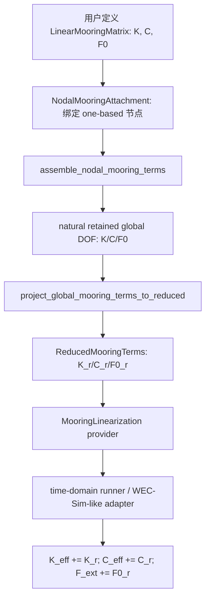

# 系泊模块总文档

日期：2026-05-24

本文档说明当前仓库中新建的系泊模块。内容分为三部分：

1. 理论：说明线性系泊、WEC-Sim Mooring Matrix 思路、与 RODM 水弹性方程的关系。
2. 代码：说明当前实现的模块、数据结构、投影流程和适配边界。
3. 用户说明：说明如何在脚本或后续 YAML 配置中使用系泊功能。

当前实现目标是先建立一个稳定、可验证、可扩展的线性系泊框架。非线性系泊线动力学、查表系泊和 MoorDyn 耦合暂不作为第一阶段实现内容，但代码接口已经为这些后续能力预留空间。

参考背景：

- WEC-Sim 理论文档：<https://wec-sim.github.io/WEC-Sim/main/theory/theory.html>
- WEC-Sim Mooring Features：<https://wec-sim.github.io/WEC-Sim/dev/user/advanced_features.html>
- WEC-Sim Mooring Class API：<https://wec-sim.github.io/WEC-Sim/main/user/api.html>
- MoorDyn 简介：<https://www.nrel.gov/wind/nwtc/moordyn.html>

## 1. 理论

### 1.1 系泊在运动方程中的位置

WEC-Sim 将系泊力作为独立外力项接入浮体运动方程，而不是混入水动力数据本身。对当前 RODM 时域平台，含 Cummins 辐射记忆的线性方程可写为：

```text
(M_struct + A_inf + A_res) qdd(t)
+(C_res + C_moor) qd(t)
+[K_struct + K_hs + K_moor] q(t)
+ integral K_rad(tau) qd(t - tau) d tau
= F_wave(t) + F_moor0
```

其中：

| 符号 | 含义 |
| --- | --- |
| `q(t)` | reduced/master DOF 位移向量。 |
| `M_struct` | 结构缩减质量。 |
| `A_inf` | 无限频率附加质量。 |
| `A_res` | 可选的选频残余附加质量。 |
| `C_res` | 可选的选频残余辐射阻尼。 |
| `K_struct` | 结构缩减刚度。 |
| `K_hs` | 静水恢复刚度。 |
| `K_rad(t)` | 辐射记忆核。 |
| `K_moor` | 线性化系泊刚度。 |
| `C_moor` | 线性化系泊阻尼。 |
| `F_moor0` | 系泊预张力或静态平衡力。 |

频域单频线性方程中，若需要线性系泊，则可把 `K_moor` 与 `C_moor` 加入动态刚度：

```text
[-omega^2 M - i omega (C_rad + C_moor) + (K + K_moor)] Q = F_wave
```

但 `F_moor0` 是常值/均值力，不属于谐波 RAO 激励。除非先做静平衡或均值漂移分析，否则默认不应把预张力直接加入频域 RAO 右端项。

### 1.2 WEC-Sim Mooring Matrix 约定

WEC-Sim 的 Mooring Matrix 方法使用线性矩阵描述系泊恢复力。其核心思想可以写成：

```text
F_moor = F0 - K_moor q - C_moor qd
```

其中 `q` 是浮体 6DOF 位移：

```text
[surge, sway, heave, roll, pitch, yaw]
```

`F_moor` 和 `F0` 是 6DOF 广义力：

```text
[Fx, Fy, Fz, Mx, My, Mz]
```

`K_moor` 和 `C_moor` 是 6x6 广义刚度/阻尼矩阵。它们的单位是混合单位：

- 平移力对平移位移：`N/m`
- 平移力对转角：`N/rad`
- 力矩对平移位移：`N*m/m`
- 力矩对转角：`N*m/rad`
- 阻尼矩阵同理，对速度或角速度建立广义阻尼力。

### 1.3 RODM 与 WEC-Sim 约定的差异

WEC-Sim 通常以单个刚体 6DOF 为对象。当前 RODM 是柔性网格/缩减阶模型：

```text
结构全阶节点: 通常 6DOF / node
RODM retained 节点: 当前常用 5DOF / node
被删除 DOF: yaw, zero-based index = 5
reduced/master DOF: 由 SEREP 或 Guyan 等结构缩减方法生成
```

因此，本仓库不能直接把一个 WEC-Sim 6x6 `K_moor` 加到 reduced 矩阵上。正确流程是：

1. 明确系泊附着在哪个结构节点。
2. 在该节点的 6DOF 局部坐标中定义 `K/C/F0`。
3. 删除 RODM 未保留的 full DOF，例如 yaw。
4. 装配到 natural retained global DOF 顺序。
5. 用已有结构缩减变换投影到 reduced/master DOF。

投影公式为：

```text
K_moor_reduced = T.T K_moor_global_disordered T
C_moor_reduced = T.T C_moor_global_disordered T
F_moor0_reduced = T.T F_moor0_global_disordered
```

这里的 `T` 是现有 SEREP/Guyan 缩减变换矩阵；`global_disordered` 使用与结构缩减一致的 master/slave 排列。

### 1.4 当前阶段的物理边界

当前模块代表线性化系泊，不代表完整非线性缆索动力学。适用场景包括：

- 低频 stationkeeping 的线性稳定项。
- 已知线性化系泊刚度矩阵的算例。
- 对 WEC-Sim Mooring Matrix 方法的本地复现。
- 时域直接卷积或状态空间辐射模型中的线性外部恢复力。

暂不覆盖：

- 非线性悬链线形状求解。
- 系泊线质量、阻尼、海流载荷、海床接触。
- MoorDyn 动态耦合。
- 多体约束中的复杂铰接-系泊耦合。

这些能力后续可以通过新的系泊模型类输出相同的 reduced `K/C/F0` 或时变外力接口，再接入现有平台。

## 2. 代码

### 2.1 新增模块

正式系泊模块位于：

```text
src/offshore_energy_sim/mooring/
├── __init__.py
├── config.py
└── linear.py
```

核心对象：

| 对象 | 位置 | 作用 |
| --- | --- | --- |
| `LinearMooringMatrix` | `mooring.linear` | WEC-Sim Mooring Matrix 风格的 `K/C/F0` 线性模型。 |
| `NodalMooringAttachment` | `mooring.linear` | 将一个线性系泊矩阵挂到一个 one-based 结构节点。 |
| `GlobalMooringTerms` | `mooring.linear` | natural retained global DOF 下的 `K/C/F0`。 |
| `ReducedMooringTerms` | `mooring.linear` | reduced/master DOF 下的 `K/C/F0`。 |
| `assemble_nodal_mooring_terms` | `mooring.linear` | 将多个节点系泊装配到 global retained DOF。 |
| `project_global_mooring_terms_to_reduced` | `mooring.linear` | 将 global 系泊项投影到 reduced/master DOF。 |
| `build_nodal_mooring_reduced_terms` | `mooring.linear` | 装配并投影的便捷入口。 |
| `build_mooring_attachments_from_config` | `mooring.config` | 从 YAML-like `mooring` 段构造 attachment。 |
| `build_reduced_mooring_terms_from_config` | `mooring.config` | 从配置、case 和 structural reduction 直接生成 reduced `K/C/F0`。 |
| `build_mooring_provider_from_config` | `mooring.config` | 生成可传给主时域求解器或 WEC-Sim-like adapter 的 provider。 |

### 2.2 配置和适配器层变更

现有 WEC-Sim-like 时域适配器已经支持新的系泊项：

```text
src/offshore_energy_sim/time_domain_adapter/wecsim_like_solver.py
src/offshore_energy_sim/time_domain_adapter/cummins_solver.py
src/offshore_energy_sim/time_domain/solver.py
scripts/run_rodm_case_from_config.py
```

适配器接口：

```python
MooringLinearization(
    reduced_stiffness=K_moor_reduced,
    metadata={...},
    reduced_damping=C_moor_reduced,
    reduced_pretension=F_moor0_reduced,
)
```

仍兼容旧写法：

```python
MooringLinearization(K_moor_reduced, metadata={...})
```

因此原有四角弹簧验证脚本不会被破坏；新代码只是在有 damping 或 pretension 输入时增加相应项。

主配置入口 `scripts/run_rodm_case_from_config.py --domain time` 已经能够读取 `mooring:` 配置段。启用系泊后，结果会写入独立 variant，例如：

```text
results/<case_id>/variants/time_domain_mooring/
```

该目录会额外保存：

```text
mooring_reduced_stiffness.npy
mooring_reduced_damping.npy
mooring_reduced_pretension.npy
```

并在 `metrics.json` 的 `mooring` 小节中记录 attachment、节点、矩阵范数和输出路径。

### 2.3 数据流



### 2.4 数值影响说明

默认没有系泊输入时：

```text
K_moor = 0
C_moor = 0
F_moor0 = 0
```

现有频域和时域结果预期不变。

显式传入系泊输入时：

- `K_moor` 改变系统刚度。
- `C_moor` 改变系统阻尼。
- `F_moor0` 改变时域外力均值。
- 数值结果会有意改变，需要记录系泊参数并做验证。

### 2.5 测试

当前测试文件：

```text
tests/test_mooring.py
tests/test_mooring_config.py
tests/test_mooring_adapter.py
tests/test_wecsim_like_adapter.py
```

覆盖内容：

- WEC-Sim 线性系泊力公式：`F0 - K*q - C*qdot`。
- 6DOF 系泊矩阵到 RODM retained DOF 的裁剪。
- nodal attachment 到 global retained DOF 的装配。
- global 系泊项到 reduced/master DOF 的投影。
- YAML-like 配置到 attachment/provider 的构造。
- 旧 reduced stiffness provider 的兼容性。
- 新 reduced damping / reduced pretension 的适配器解析。

最近验证结果：

```text
87 passed in 2.49s
```

基础线性框架还提供独立验证脚本：

```powershell
.\.venv\Scripts\python.exe scripts\validate_mooring_linear_framework.py
```

该脚本会输出：

```text
results/mooring/linear_framework_validation/metrics.json
docs/mooring_linear_framework_validation_2026_05_24.md
results/mooring/linear_framework_validation/figures/
```

当前生成的图件包括：

| 图件 | 说明 |
| --- | --- |
| `linear_mooring_error_summary.png` | 公式、节点装配、降阶投影、配置 provider、1DOF/2DOF 时域闭合的误差汇总。 |
| `sdof_time_frequency_comparison.png` | 1DOF 含系泊系统的时域响应、频域解析响应和拟合响应对比。 |
| `sdof_complex_amplitude_comparison.png` | 频域复幅值和时域拟合复幅值的 real/imag/abs 对比。 |
| `force_formula_comparison.png` | `F0 - K*q - C*qdot` 公式计算值与期望值对比。 |
| `nodal_assembly_error.png` | 6DOF 到 retained DOF 装配误差图。 |
| `reduced_projection_comparison.png` | reduced `K/C/F0` 投影结果与解析期望对比。 |
| `config_provider_comparison.png` | YAML-like 配置 provider 输出的 reduced `K/C/F0` 与解析期望对比。 |
| `coupled_2dof_complex_amplitude_comparison.png` | 2DOF 耦合 `K_moor/C_moor` 的时域拟合与频域解析对比。 |

最近一次基础验证结果：

```text
force_formula max error: 0
nodal_assembly max error: 0
reduced_projection max error: 0
config_provider max error: 0
1DOF harmonic relative error: 1.489921e-04
2DOF coupled harmonic relative error: 2.360569e-05
static offset abs error: 5.904213e-05
```

## 3. 用户说明

### 3.1 最小示例：定义一个 WEC-Sim 风格线性系泊矩阵

```python
import numpy as np

from offshore_energy_sim.mooring import LinearMooringMatrix

mooring = LinearMooringMatrix(
    stiffness=np.diag([1.0e7, 1.0e7, 0.0, 0.0, 0.0, 0.0]),
    damping=np.diag([1.0e5, 1.0e5, 0.0, 0.0, 0.0, 0.0]),
    pretension=np.array([0.0, 0.0, 0.0, 0.0, 0.0, 0.0]),
)

force = mooring.force(
    displacement=np.array([0.2, -0.1, 0.0, 0.0, 0.0, 0.0]),
    velocity=np.array([0.01, 0.02, 0.0, 0.0, 0.0, 0.0]),
)
```

此例表示 surge/sway 两个方向有线性恢复刚度和阻尼，heave/roll/pitch/yaw 不加系泊。

### 3.2 将系泊挂到结构节点并投影到 reduced DOF

```python
import numpy as np

from offshore_energy_sim.mooring import (
    LinearMooringMatrix,
    NodalMooringAttachment,
    build_nodal_mooring_reduced_terms,
)

attachments = [
    NodalMooringAttachment(
        node_one_based=1,
        matrix=LinearMooringMatrix(
            stiffness=np.diag([1.0e7, 1.0e7, 0.0, 0.0, 0.0, 0.0]),
            damping=np.diag([1.0e5, 1.0e5, 0.0, 0.0, 0.0, 0.0]),
        ),
        name="front_left_line",
    ),
]

reduced_mooring = build_nodal_mooring_reduced_terms(
    attachments,
    total_nodes=case.total_nodes,
    retained_full_dofs_zero_based=(0, 1, 2, 3, 4),
    transformation=structural.transformation,
    master_dofs=structural.master_dofs,
    slave_dofs=structural.slave_dofs,
    reverse_master_order=structural.reverse_master_order_for_reconstruction,
)
```

说明：

- `node_one_based` 使用 Abaqus/结构网格的一基节点编号。
- `retained_full_dofs_zero_based=(0,1,2,3,4)` 表示保留 surge/sway/heave/roll/pitch，删除 yaw。
- `structural` 是 `prepare_structural_reduction(case, master_nodes)` 的结果。

### 3.3 接入 WEC-Sim-like 时域适配器

可以通过 provider 方式接入：

```python
from offshore_energy_sim.time_domain_adapter import MooringLinearization


def mooring_provider(case, structural):
    retained_full_dofs_zero_based = tuple(
        index
        for index in range(case.full_dofs_per_node)
        if index not in case.removed_full_dofs_zero_based
    )
    reduced_mooring = build_nodal_mooring_reduced_terms(
        attachments,
        total_nodes=case.total_nodes,
        retained_full_dofs_zero_based=retained_full_dofs_zero_based,
        transformation=structural.transformation,
        master_dofs=structural.master_dofs,
        slave_dofs=structural.slave_dofs,
        reverse_master_order=structural.reverse_master_order_for_reconstruction,
    )
    return MooringLinearization(
        reduced_stiffness=reduced_mooring.stiffness,
        reduced_damping=reduced_mooring.damping,
        reduced_pretension=reduced_mooring.pretension,
        metadata=reduced_mooring.metadata,
    )
```

注意：上面示例中的 `retained_full_dofs_zero_based` 应该传入“保留的 full DOF”。当前 300 m RODM 常规算例删除 yaw，因此保留 DOF 是：

```python
retained_full_dofs_zero_based = tuple(
    index
    for index in range(case.full_dofs_per_node)
    if index not in case.removed_full_dofs_zero_based
)
```

然后传给时域平台：

```python
result = solve_rodm_wecsim_like_time_domain(
    case,
    config,
    radiation=radiation_config,
    mooring_provider=mooring_provider,
)
```

WEC-Sim-like 平台入口也可以直接读取正式 `offshore_energy_sim.mooring` YAML 配置：

```powershell
.\.venv\Scripts\python.exe scripts\run_wecsim_like_time_domain_platform.py `
  --mooring-config configs\your_case.yaml
```

该入口会在结果目录写出 `mooring_summary.json`、`mooring_reduced_stiffness.npy`、`mooring_reduced_damping.npy` 和 `mooring_reduced_pretension.npy`，并在 `report.md` 中加入 Mooring 小节。

### 3.4 四角水平弹簧仍可使用

旧的 adapter-level 四角弹簧仍保留在：

```text
src/offshore_energy_sim/time_domain_adapter/mooring.py
```

它适合做快速 stationkeeping 验证：

```powershell
.\.venv\Scripts\python.exe scripts\run_wecsim_like_time_domain_platform.py `
  --mooring-corner-horizontal-stiffness 10000000
```

该入口只表示简化线性弹簧，不代表最终物理系泊模型。正式新开发建议优先使用 `offshore_energy_sim.mooring` 包。

### 3.5 参数建议

使用线性系泊时，建议每次记录：

- 节点编号和结构网格尺寸。
- 6DOF 坐标约定。
- `K_moor` 和 `C_moor` 的单位。
- `F_moor0` 的方向和物理含义。
- 是否删除 yaw 或其他 DOF。
- 是否经过 SEREP/Guyan 投影。
- 系泊是否只用于时域，还是也用于频域线性响应。

### 3.6 YAML 配置

当前模板 `configs/templates/rodm_frequency_case.yaml` 已经包含 `mooring` 配置段。用户可以在算例配置中加入：

```yaml
mooring:
  enabled: true
  model: linear_matrix
  retained_full_dofs_zero_based: [0, 1, 2, 3, 4]
  attachments:
    - name: front_left_line
      node_one_based: 1
      stiffness:
        diagonal: [1.0e7, 1.0e7, 0.0, 0.0, 0.0, 0.0]
      damping:
        diagonal: [1.0e5, 1.0e5, 0.0, 0.0, 0.0, 0.0]
      pretension: [0.0, 0.0, 0.0, 0.0, 0.0, 0.0]
```

推荐先只支持 `diagonal` 和完整 `matrix` 两种输入形式：

```yaml
stiffness:
  matrix:
    - [ ... six values ... ]
    - [ ... six values ... ]
    - [ ... six values ... ]
    - [ ... six values ... ]
    - [ ... six values ... ]
    - [ ... six values ... ]
```

配置驱动时域运行方式：

```powershell
.\.venv\Scripts\python.exe scripts\run_rodm_case_from_config.py `
  --config configs\your_case.yaml `
  --domain time
```

如果 `mooring.enabled: true`，runner 会自动：

1. 读取 `mooring.attachments`；
2. 构造 nodal `K/C/F0`；
3. 投影为 reduced `K/C/F0`；
4. 将 `K_moor` 加到时域刚度；
5. 将 `C_moor` 加到时域阻尼；
6. 将 `F_moor0` 加到时域外力；
7. 保存 reduced 系泊矩阵和 metrics。

### 3.7 独立 demo

若只想检查矩阵方向、节点装配和 reduced 输出，不需要真实 DM-FEM2D 数据，可运行：

```powershell
.\.venv\Scripts\python.exe scripts\run_mooring_linear_matrix_demo.py `
  --scenario one_node
```

四角节点线性系泊示例：

```powershell
.\.venv\Scripts\python.exe scripts\run_mooring_linear_matrix_demo.py `
  --scenario four_corner `
  --grid-nodes-x 2 `
  --grid-nodes-y 2
```

YAML 输入示例：

```powershell
.\.venv\Scripts\python.exe scripts\run_mooring_linear_matrix_demo.py `
  --scenario yaml `
  --config configs\templates\mooring_linear_demo.yaml
```

输出位于 `results/mooring/linear_matrix_demo/`，包括 reduced `K/C/F0`、`metrics.json` 和两张快速检查图。

### 3.8 验证建议

每新增一个实际系泊算例，至少做以下检查：

1. `K_moor` 和 `C_moor` 维度正确。
2. reduced 后矩阵对称。
3. reduced 后刚度特征值不出现明显负值，除非有明确物理解释。
4. 无系泊与有系泊结果差异符合预期。
5. heave 主导响应不应被水平 stationkeeping 弹簧异常污染。
6. 对状态空间辐射模型，比较 direct convolution 与 state-space 的中心线 heave RMS。

### 3.9 当前限制

当前模块是线性化框架，不会自动计算系泊线几何、缆长、锚点位置、浮筒 fairlead 位置和预张力。若用户有 MoorDyn 或外部准静态系泊软件输出，应先把它线性化成 `K/C/F0`，再通过本模块接入。

后续可扩展方向：

- `LookupTableMooring`：读取 6DOF 位移-力查表并插值。
- `MoorDynAdapter`：调用外部 MoorDyn 或读取 MoorDyn 线性化结果。
- `MultiAttachmentMooringSystem`：统一管理多条线、多节点、多方向矩阵。
- 300 m RODM 实际数据下的有/无系泊对比验证。
