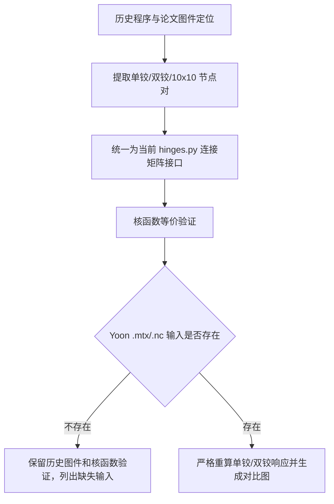

# 已发表铰接程序定位与核函数验证

生成时间：2026-04-29 17:47:30

## 1. 结论先行

本轮定位到两类关键程序：

- 论文/Yoon 对比主线：`FEM_Reducev2/RODM_Hige_study_plan_a_2.ipynb` 更像最终论文程序候选；它与 Yoon 参考 CSV、历史输出文件位于同一工作目录，并使用 `k_hinge=1E15`、释放自由度小惩罚 `1` 的双铰接方案。
- 当前迁移工作主线：本地 `RODM_Hige_study_plan_a_2.ipynb` 包含单铰、双铰、斜入射双铰等完整实验分支，常用 `k_hinge=1e10`、释放自由度小惩罚 `100`。
- 10x10 多铰接主线：本地 `RODM_2D_complex.ipynb` 调用 `RODM_complex_interconnection.py`，对应 100 个模块、180 条铰接线、1260 对铰接节点。

当前重构包已经可以精确表达这些铰接连接矩阵；但严格重算单铰/双铰响应仍缺少 Yoon 专用 `.mtx/.nc` 输入文件。

## 2. 程序和图件定位

为避免后续继续依赖 OneDrive，本轮已将论文候选程序、CSV 和图件复制到本地 `references/hinge_published/`。

| 类型 | 路径 | SHA/状态 |
| --- | --- | --- |
| 论文候选程序本地归档 | `/Users/yongkang/Projects/RODM_20250310_local/references/hinge_published/programs/RODM_Hige_study_plan_a_2_FEM_Reducev2.ipynb` | `exists=True, sha256=c62e009dc9ed266a` |
| 论文候选程序原始位置 | `/Users/yongkang/Library/CloudStorage/OneDrive-宁波东方理工大学/FEM_Reducev2/RODM_Hige_study_plan_a_2.ipynb` | `exists=True, sha256=c62e009dc9ed266a` |
| 本地迁移程序 | `/Users/yongkang/Projects/RODM_20250310_local/RODM_Hige_study_plan_a_2.ipynb` | `exists=True, sha256=f4006a2e799c94b8` |
| 10x10 程序 | `/Users/yongkang/Projects/RODM_20250310_local/RODM_2D_complex.ipynb` | `exists=True, sha256=aba988e5504e60d6` |
| 10x10 铰接辅助函数 | `/Users/yongkang/Projects/RODM_20250310_local/RODM_complex_interconnection.py` | `exists=True, sha256=d4dfe91855736cfa` |
| 论文图件本地归档 | `/Users/yongkang/Projects/RODM_20250310_local/references/hinge_published/figures` | `exists=True` |
| 论文图件原始目录 | `/Users/yongkang/Library/CloudStorage/OneDrive-宁波东方理工大学/论文Submit/OE_special_250308/Revise/Hydroelasticity RODM - Advantages and Application/Figs` | `exists=True` |

## 3. 单铰、双铰、10x10 参数

| 算例 | 程序来源 | 关键参数 | 当前验证 |
| --- | --- | --- | --- |
| 单铰接 | 本地 `RODM_Hige_study_plan_a_2.ipynb` | 2 个模块，13 对节点，`k=1e10`，释放 DOF=4，小惩罚=100，Yoon 180 deg 水动力 | 连接核函数通过；响应重算缺输入 |
| 双铰接 | `FEM_Reducev2/RODM_Hige_study_plan_a_2.ipynb` / 本地同名 notebook | 3 个模块，26 对节点；论文候选为 `k=1E15`、小惩罚=1；本地迁移版为 `k=1e10`、小惩罚=100 | 两套连接核函数均通过；响应重算缺输入 |
| 10x10 多铰接 | `RODM_2D_complex.ipynb` + `RODM_complex_interconnection.py` | 100 个模块，x/y 各 90 条铰接线，合计 1260 对节点；x 释放 DOF=4，小惩罚=10；y 释放 DOF=3，小惩罚=10 | 2x2 子核函数精确通过；10x10 只统计节点对，未构造 29400x29400 稠密矩阵 |

## 4. 核函数验证结果

| 检查项 | 节点对数 | 释放 DOF | 小惩罚刚度 | 最大误差 |
| --- | ---: | --- | ---: | ---: |
| DM_Hinge.py legacy zero-release connector | 3 | `[4]` | `0.0` | `0` |
| local RODM_20250310 single hinge, KC[4]=100 | 13 | `[4]` | `100.0` | `0` |
| local RODM_20250310 double hinge, KC[4]=100 | 26 | `[4]` | `100.0` | `0` |
| FEM_Reducev2 paper-candidate double hinge, KC[4]=1 | 26 | `[4]` | `1.0` | `0` |
| RODM_complex_interconnection.py 2x2 direction=0 | 14 | `[4]` | `10.0` | `0` |
| RODM_complex_interconnection.py 2x2 direction=1 | 14 | `[3]` | `10.0` | `0` |

## 5. 严格响应重算的阻塞文件

以下文件当前没有在 OneDrive 或本机可搜索范围中找到，因此不能在 Mac 上严格复现 Yoon 单铰/双铰响应：
- `StructureData/Yoon_hinge/Job_hinge_study_150_60_YoonModel_MASS1.mtx`
- `StructureData/Yoon_hinge/Job_hinge_study_150_60_YoonModel_STIF1.mtx`
- `StructureData/Yoon_hinge/Job_hinge_study_100_60_YoonModel-1_MASS1_rho282.mtx`
- `StructureData/Yoon_hinge/Job_hinge_study_100_60_YoonModel-1_STIF1_rho282.mtx`
- `HydrodynamicData/Yoon_hinge/DM10_direction180_slender180_rho1025.nc`
- `HydrodynamicData/Yoon_hinge/DM10_direction210_slender180_rho1025.nc`
- `StructureData/Hinge_complex_paper4/Job3030hinge-1_MASS1.mtx`
- `StructureData/Hinge_complex_paper4/Job3030hinge-1_STIF1.mtx`
- `HydrodynamicData/Yoon_hinge/DM10_10_direction0_wl180.nc`

现有 `scripts/run_yoon_hinge_response_validation.py` 的 793 节点代理响应分支在 Mac 上也需要以下输入；本轮运行时首先停在 `JobMesh5_5_MASS1.mtx`：
- `StructureData/JobMesh5_5_MASS1.mtx`
- `StructureData/JobMesh5_5_STIF1.mtx`
- `StructureData/ELEMENTSTIFFNESS_793.mtx`
- `HydrodynamicData/Yoga/BM10_145_direaction180.nc`

## 6. 后续建议

1. 优先恢复 `StructureData/Yoon_hinge` 与 `HydrodynamicData/Yoon_hinge` 中的原始 Yoon 输入文件，再跑响应级单铰/双铰对比。
2. 后续优化程序应使用重构包中的可配置释放刚度，不要再写死 `0`、`1`、`10` 或 `100`。
3. 10x10 问题不建议继续构造 29400x29400 稠密铰接矩阵，后续应改成稀疏矩阵或块装配，否则内存会很快变成小怪兽。

## 7. 流程图

