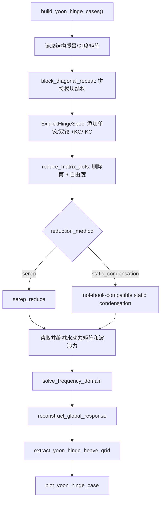

# Yoon 铰接验证标准接口说明

日期：2026-04-29

本文档说明 `RODM_Hige_study_plan_a_2.ipynb` 已验证铰接程序的标准化结果。目标是让后续一体化分析软件不再直接运行 notebook，而是调用清晰的 Python 包接口。

## 1. 标准化结果

核心接口位于：

| 文件 | 职责 |
| --- | --- |
| `src/offshore_energy_sim/structure/hinges.py` | 定义通用铰接连接矩阵，包括按列铰接 `HingeLineSpec` 和显式节点对铰接 `ExplicitHingeSpec`。 |
| `src/offshore_energy_sim/validation/yoon_hinge.py` | 从 notebook 抽出的 Yoon 单铰、双铰算例定义、矩阵装配、降阶求解、后处理绘图。 |
| `scripts/run_yoon_hinge_cases.py` | 一键运行单铰、双铰、斜入射双铰验证；数据未到位时输出缺失清单。 |
| `results/yoon_hinge_standard/` | 标准入口的运行结果、响应数组、图像和报告。 |

## 2. 已纳入的算例

| 算例 ID | 来源 | 铰接设置 | 降阶方法 | 说明 |
| --- | --- | --- | --- | --- |
| `single_180` | notebook 单铰接模型 | 1 条铰接线，13 对节点，`k=1e10`，释放 DOF=4，小惩罚=100 | SEREP | 与 Yoon 单铰/试验中心线对比。 |
| `double_180` | notebook 正入射双铰接模型 | 2 条铰接线，26 对节点，`k=1e10`，释放 DOF=4，小惩罚=100 | Static Condensation | 与 Yoon 三条横向剖面和试验中心线对比。 |
| `double_210` | notebook 斜入射双铰接模型 | 2 条铰接线，26 对节点，`k=1e10`，释放 DOF=4，小惩罚=100 | SEREP | 与 Yoon 斜入射三条剖面对比。 |
| `double_240` | notebook 斜入射双铰接扩展模型 | 2 条铰接线，26 对节点，`k=1e10`，释放 DOF=4，小惩罚=100 | SEREP | 生成 RODM 三条剖面，并渲染历史论文图件作对照。 |
| `double_270` | notebook 斜入射双铰接扩展模型 | 2 条铰接线，26 对节点，`k=1e10`，释放 DOF=4，小惩罚=100 | SEREP | 生成 RODM 三条剖面，并渲染历史论文图件作对照。 |

## 3. 调用流程



## 4. 运行方式

默认数据根目录为 `/Users/yongkang/data/DM-FEM2D`，也可以通过环境变量 `RODM_DM_FEM_ROOT` 或命令行参数指定。

```bash
/Users/yongkang/miniconda3/envs/offshore-energy-sim/bin/python scripts/run_yoon_hinge_cases.py --case all
```

只运行单铰：

```bash
/Users/yongkang/miniconda3/envs/offshore-energy-sim/bin/python scripts/run_yoon_hinge_cases.py --case single_180
```

指定数据目录：

```bash
/Users/yongkang/miniconda3/envs/offshore-energy-sim/bin/python scripts/run_yoon_hinge_cases.py --case all --data-root /path/to/DM-FEM2D
```

## 5. 当前状态

标准接口、核函数和输入检查已完成。数据到位后运行同一个脚本即可生成响应、对比图和历史论文图件渲染。当前输出目录为 `results/yoon_hinge_standard/`。

旧 notebook 暂时保留为数值溯源依据，不作为后续一体化软件的直接运行入口。
